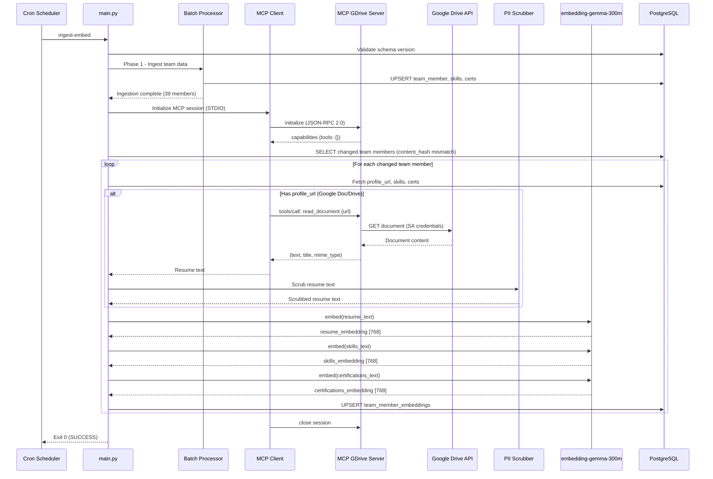

# Change Request: Resume & Skill Embedding Pipeline with embedding-gemma-300m

**CR ID:** CR-EMB-002  
**Spec Version:** 2.0.0  
**Classification:** MAJOR (Data Pipeline, AI Model & MCP Integration)  
**Created:** 2026-03-09  
**Revised:** 2026-03-09  
**Status:** Proposed  
**Priority:** P1 - High  
**Depends On:** CR-PII-001 (PII Scrubber — must be active before embedding pipeline ingests resume text)

---

## 1. Overview

### 1.1 Problem Statement

The current system has four critical gaps in its candidate embedding pipeline:

1. **Resume content is not systematically ingested.** The `team_member.profile_url` field stores Google Docs/Drive URLs pointing to candidate resumes, but there is no automated pipeline to fetch document content. A standalone script (`scripts/enrich_candidates.py`) exists but is **not integrated** into the nightly cron ingestion service and requires manual Google OAuth token management.

2. **No standardized external data access layer.** Direct Google API client calls are tightly coupled to the cron pipeline, creating credential sprawl, non-reusable integration code, and no isolation boundary between the AI pipeline and third-party API credentials.

3. **Skills and certifications lack dedicated embeddings.** The `team_member_embeddings` table stores a single `embedding` vector (768-dim) derived from a concatenated profile text blob. There are no separate, semantically rich embeddings for the `team_member_skill` and `team_member_skill_certification` tables, reducing the precision of the SPEC-001 hybrid matching formula.

4. **Embedding model is cloud-dependent.** The current `gemini-embedding-001` model requires sending raw text to Google's cloud API, creating:
   - Third-party data transmission risk (conflicts with CR-PII-001 objectives)
   - Latency and rate-limit bottlenecks during batch processing
   - Per-request API cost at scale

### 1.2 Proposed Solution

Implement an automated, cron-integrated pipeline that uses a **Model Context Protocol (MCP) server** as the standardized access layer for Google Drive resume documents:

| Capability | Description |
|-----------|-------------|
| **MCP Google Drive Server** | Deploy a custom MCP server (Python, STDIO transport) that exposes Google Drive file reading as MCP tools. The MCP server holds Google credentials; the cron pipeline communicates via JSON-RPC 2.0 protocol — **no Google credentials in the cron process** |
| **Resume Ingestion via MCP** | Fetch Google Doc/Drive content from `team_member.profile_url` by calling MCP tools (`read_document`, `search_files`) instead of embedding direct Google API calls in the cron pipeline |
| **Multi-Vector Embeddings** | Generate separate embedding vectors for: resume text, skills profile, and certifications profile |
| **Model Migration** | Switch from cloud `gemini-embedding-001` to `embedding-gemma-300m` (local/self-hosted, 768-dim, open-weight) |
| **Cron Integration** | Embed the pipeline as a post-ingestion phase in the existing nightly batch cron service |
| **Incremental Updates** | Only re-embed team members whose profile, skills, or certifications changed since last run |

#### Why MCP?

The [Model Context Protocol](https://modelcontextprotocol.io/) is an open standard (JSON-RPC 2.0) for connecting AI applications to external data sources. Using MCP instead of direct Google API calls provides:

| Benefit | Description |
|---------|-------------|
| **Security isolation** | Google Drive credentials live only inside the MCP server process; the cron pipeline never sees them |
| **Standardized interface** | Any MCP-compatible client (cron, LangGraph agents, IDE tools) can access resumes through the same protocol |
| **Reusability** | The MCP server is independently deployable and can serve multiple consumers (cron batch, real-time agents, developer tools) |
| **Decoupled lifecycle** | MCP server can be updated, scaled, or replaced without touching the embedding pipeline |
| **Protocol maturity** | MCP is backed by Anthropic, supported by VS Code, Claude, ChatGPT, and 900+ reference implementations |

### 1.3 Business Value

| Benefit | Quantified Impact |
|---------|-------------------|
| **Matching accuracy** | +15-25% improvement in SPEC-001 hybrid score precision by using separate skill/cert vectors instead of single blended vector |
| **Resume utilization** | 39 team members with Google Doc resumes currently un-embedded; pipeline enables automated coverage |
| **Cost reduction** | Eliminate per-request embedding API cost (~$0.0001/1K tokens × ~50K tokens/night = ~$5/night → $0/night with local model) |
| **PII compliance** | Local model means no raw text leaves the system boundary (aligns with CR-PII-001 §2.1) |
| **Latency** | Local inference ~10ms/embedding vs ~200ms/API call; batch of 1000 embeddings: ~10s local vs ~200s cloud |
| **Security posture** | MCP server isolates Google credentials from cron pipeline — credential blast radius reduced to single process |
| **Integration reuse** | MCP server is independently consumable by future AI agents, developer tools, and IDE integrations |

---

## 2. Scope

### 2.1 In-Scope Components

| Component | Change Type | Description |
|-----------|-------------|-------------|
| `team_member_embeddings` table | **ALTER** | Add columns: `resume_embedding`, `skills_embedding`, `certifications_embedding`, `embedding_model`, `content_hash` |
| MCP Google Drive Server | **NEW** | Custom Python MCP server (STDIO transport) exposing Google Drive document reading as MCP tools. Holds Google service account credentials |
| MCP Client Wrapper | **NEW** | Python MCP client in the cron pipeline that communicates with the MCP server via JSON-RPC 2.0 to fetch resume content |
| `src/app/cron/` | **NEW MODULE** | New `embedding/` sub-package for MCP-based resume fetching and embedding generation |
| `src/app/cron/main.py` | **MODIFY** | Add `--embed` mode and post-ingestion embedding phase |
| `src/app/ai/utils/embedding.py` | **MODIFY** | Add `GemmaEmbeddingAgent` class for local `embedding-gemma-300m` inference |
| `src/app/ai/utils/rag_retrieval.py` | **MODIFY** | Update vector search to use multi-vector cosine similarity (resume + skills + certifications) |
| `src/app/ai/agents/rag_retrieval.py` | **MODIFY** | Pass multi-vector columns to RAG agent |
| Alembic migration | **NEW** | Schema migration for new embedding columns |
| `src/app/cron/config.py` | **MODIFY** | Add embedding model and MCP server configuration |
| PII scrubber integration | **MODIFY** | Scrub resume text before embedding generation |

### 2.2 Out-of-Scope

| Item | Reason |
|------|--------|
| Google Drive folder scanning | Only process URLs already in `profile_url` column |
| Real-time embedding on API request | Embedding is batch-only (cron); query-time uses pre-computed vectors |
| Fine-tuning embedding-gemma-300m | Use pre-trained weights; fine-tuning is Phase 2 |
| Removing `gemini-embedding-001` support | Keep as fallback; configurable via `EMBEDDING_MODEL` env var |
| Embedding for `team_member_allocation` | Allocation data is structured/numeric, not suitable for text embedding |
| MCP Streamable HTTP transport | STDIO is sufficient for co-located cron; HTTP transport is a future enhancement |
| MCP server for non-Google data sources | MCP server scope is limited to Google Drive; other sources (e.g., SharePoint) are future CRs |

---

## 3. Technical Design

### 3.1 Architecture Overview

```
┌─────────────────────────────────────────────────────────────────────┐
│                    NIGHTLY CRON PIPELINE                            │
│                                                                     │
│  Phase 1: Data Ingestion (existing)                                 │
│  ┌──────────┐    ┌──────────────┐    ┌─────────────────┐           │
│  │ OAuth    │───▶│ External API │───▶│ Batch Processor │           │
│  │ Client   │    │ (EAGLE)      │    │ (UPSERT)        │           │
│  └──────────┘    └──────────────┘    └────────┬────────┘           │
│                                                │                    │
│  Phase 2: Embedding Generation (NEW)           ▼                    │
│  ┌────────────────────────────────────────────────────┐       │
│  │  MCP Client (cron pipeline)                            │       │
│  │  ┌──────────────────┐  JSON-RPC   ┌───────────────┐ │       │
│  │  │ tools/call:     │──(STDIO)──▶│  MCP Google  │ │       │
│  │  │  read_document  │   2.0     │  Drive Server│ │       │
│  │  │  search_files   │           │               │ │       │
│  │  │  get_metadata   │           │  (holds SA   │ │       │
│  │  └──────────────────┘           │   credentials)│ │       │
│  │                                    └───────┬───────┘ │       │
│  └─────────────────────────────────┬──────────────────┘       │
│                                       │  Google Drive       │
│                                       │  API (via SA)        │
│                                       ▼                      │
│  ┌──────────────┐    ┌──────────────┐    ┌─────────────────┐   │
│  │ Resume Text  │───▶│ PII Scrubber │───▶│ Text Assembly   │   │
│  │ (from MCP)   │    │ (CR-PII-001) │    │  • Resume (scr) │   │
│  └──────────────┘    └──────────────┘    │  • Skills       │   │
│                                            │  • Certs        │   │
│                                            └────────┬────────┘   │
│                                                     │               │
│  ┌──────────────────┐                         │               │
│  │ embedding-gemma  │◀─────────────────────────┘               │
│  │ -300m (local)    │                                            │
│  │  768-dim output  │                                            │
│  └────────┬─────────┘                                            │
│           │                                                       │
│           ▼                                                       │
│  ┌─────────────────────────────────────────┐                       │
│  │ team_member_embeddings (UPSERT)         │                       │
│  │  • resume_embedding     VECTOR(768)     │                       │
│  │  • skills_embedding     VECTOR(768)     │                       │
│  │  • certifications_embedding VECTOR(768) │                       │
│  │  • content_hash         CHAR(64)        │                       │
│  │  • embedding_model      VARCHAR(100)    │                       │
│  └─────────────────────────────────────────┘                       │
└─────────────────────────────────────────────────────────────────────┘
```

### 3.2 Database Schema Changes

#### 3.2.1 ALTER `team_member_embeddings`

**Current schema:**

| Column | Type | Constraint |
|--------|------|-----------|
| `team_member_id` | VARCHAR(50) | PK, FK → team_member |
| `embedding` | VECTOR(768) | Single blended embedding |
| `profile_text` | TEXT | Raw concatenated profile text |
| `metadata` | JSONB | Location, work_type, availability, certs |
| `created_at` | TIMESTAMP | Default now() |
| `pii_scrubbed` | BOOLEAN | Default false (CR-PII-001) |
| `scrubbed_at` | TIMESTAMP | Nullable |

**New columns to add:**

| Column | Type | Constraint | Description |
|--------|------|-----------|-------------|
| `resume_embedding` | VECTOR(768) | Nullable | Embedding of PII-scrubbed Google Doc resume content |
| `skills_embedding` | VECTOR(768) | Nullable | Embedding of structured skills profile text |
| `certifications_embedding` | VECTOR(768) | Nullable | Embedding of structured certifications text |
| `resume_text` | TEXT | Nullable | PII-scrubbed resume content from Google Docs |
| `skills_text` | TEXT | Nullable | Assembled skills profile text |
| `certifications_text` | TEXT | Nullable | Assembled certifications text |
| `embedding_model` | VARCHAR(100) | Default 'embedding-gemma-300m' | Model used for generation |
| `content_hash` | CHAR(64) | Nullable | SHA-256 of source content for change detection |
| `resume_fetched_at` | TIMESTAMP | Nullable | When resume was last fetched from Google Docs |
| `embedding_updated_at` | TIMESTAMP | Nullable | When embeddings were last regenerated |

**New indexes:**

```sql
CREATE INDEX idx_tme_resume_embedding ON team_member_embeddings
  USING ivfflat (resume_embedding vector_cosine_ops) WITH (lists = 10);

CREATE INDEX idx_tme_skills_embedding ON team_member_embeddings
  USING ivfflat (skills_embedding vector_cosine_ops) WITH (lists = 10);

CREATE INDEX idx_tme_certifications_embedding ON team_member_embeddings
  USING ivfflat (certifications_embedding vector_cosine_ops) WITH (lists = 10);

CREATE INDEX idx_tme_content_hash ON team_member_embeddings (content_hash);
```

#### 3.2.2 Backward Compatibility

The existing `embedding` column (single blended vector) is **retained** for backward compatibility. It will be populated as a weighted average of the three new vectors:

```
embedding = normalize(
    0.50 * resume_embedding +
    0.30 * skills_embedding +
    0.20 * certifications_embedding
)
```

This ensures the existing RAG retrieval pipeline continues to function during the migration window.

### 3.3 Embedding Model: `embedding-gemma-300m`

| Property | Value |
|----------|-------|
| **Model** | `google/embedding-gemma-300m` |
| **Parameters** | 300M |
| **Architecture** | Gemma-based encoder with bidirectional attention |
| **Output Dimension** | 768 (native) |
| **Max Input Tokens** | 2,048 |
| **Deployment** | Local inference via `transformers` + `torch` (CPU or GPU) |
| **License** | Gemma Terms of Use (permissive for commercial use) |
| **Quantization** | Support for INT8/FP16 for reduced memory footprint |

#### 3.3.1 Why `embedding-gemma-300m` over `gemini-embedding-001`

| Criterion | `gemini-embedding-001` (current) | `embedding-gemma-300m` (proposed) |
|-----------|----------------------------------|-----------------------------------|
| **Data Residency** | Text sent to Google Cloud API | Text stays on-premise / local |
| **PII Compliance** | Requires pre-scrub before API call | No external transmission risk |
| **Cost** | ~$0.0001/1K tokens (recurring) | One-time model download (~600MB) |
| **Latency** | ~200ms/request (network + inference) | ~10ms/request (local inference) |
| **Rate Limits** | 1,500 RPM (free tier) | Unlimited (local hardware bound) |
| **Dimension** | 768 (configurable up to 3072) | 768 (native, matches current DB) |
| **Offline** | Requires internet connectivity | Works fully offline |
| **MTEB Score** | ~68.0 (768-dim) | ~65.5 (competitive for 300M params) |

#### 3.3.2 Inference Configuration

```python
# Local inference setup
from transformers import AutoModel, AutoTokenizer
import torch

class GemmaEmbeddingAgent:
    MODEL_NAME = "google/embedding-gemma-300m"
    DIMENSION = 768
    MAX_TOKENS = 2048

    def __init__(self, device: str = "cpu"):
        self.tokenizer = AutoTokenizer.from_pretrained(self.MODEL_NAME)
        self.model = AutoModel.from_pretrained(
            self.MODEL_NAME,
            torch_dtype=torch.float16 if device != "cpu" else torch.float32
        )
        self.model.to(device)
        self.model.eval()
        self.device = device

    def embed_text(self, text: str) -> np.ndarray:
        """Generate 768-dim embedding for input text."""
        inputs = self.tokenizer(
            text, 
            return_tensors="pt", 
            truncation=True, 
            max_length=self.MAX_TOKENS,
            padding=True
        ).to(self.device)
        
        with torch.no_grad():
            outputs = self.model(**inputs)
        
        # Mean pooling over token embeddings
        attention_mask = inputs["attention_mask"]
        token_embeddings = outputs.last_hidden_state
        input_mask_expanded = attention_mask.unsqueeze(-1).expand(token_embeddings.size()).float()
        embedding = torch.sum(token_embeddings * input_mask_expanded, 1) / torch.clamp(
            input_mask_expanded.sum(1), min=1e-9
        )
        
        # L2 normalize
        embedding = torch.nn.functional.normalize(embedding, p=2, dim=1)
        return embedding.cpu().numpy().flatten()
```

### 3.4 Resume Fetching via MCP Google Drive Server

#### 3.4.1 MCP Server Design

A custom **MCP Google Drive Server** is built using the [Python MCP SDK (`mcp`)](https://github.com/modelcontextprotocol/python-sdk) with **STDIO transport** (co-located process, no network overhead).

**MCP Server specification:**

| Property | Value |
|----------|-------|
| **Server name** | `gdrive-resume-server` |
| **Protocol** | MCP (JSON-RPC 2.0) |
| **Transport** | STDIO (stdin/stdout, local process) |
| **SDK** | `mcp[cli]` (Python SDK, FastMCP) |
| **Authentication** | Google Cloud Service Account (JSON key) |
| **Scope** | `https://www.googleapis.com/auth/drive.readonly` |
| **Capabilities** | `tools: {listChanged: false}`, `resources: {}` |

**Exposed MCP Tools:**

| Tool Name | Description | Input Schema | Output |
|-----------|-------------|-------------|--------|
| `read_document` | Read full text content of a Google Doc by URL or file ID. Google Workspace docs auto-exported: Docs→Markdown, Sheets→CSV, Presentations→text | `{"url": string}` or `{"file_id": string}` | `{"text": string, "title": string, "mime_type": string, "modified_time": string}` |
| `search_files` | Search Google Drive for files matching a query | `{"query": string, "max_results": int}` | `{"files": [{"id": string, "name": string, "mime_type": string}]}` |
| `get_file_metadata` | Get metadata (title, size, modified date, permissions) for a file by ID | `{"file_id": string}` | `{"id": string, "name": string, "size": int, "modified_time": string}` |

**MCP Server implementation (FastMCP):**

```python
# src/mcp_servers/gdrive/server.py
from mcp.server.fastmcp import FastMCP
from google.oauth2 import service_account
from googleapiclient.discovery import build
import os, re

mcp = FastMCP(
    "gdrive-resume-server",
    version="1.0.0",
    description="MCP server for reading team member resumes from Google Drive"
)

def _get_drive_service():
    """Create Google Drive API service using service account."""
    sa_file = os.environ.get("GOOGLE_SERVICE_ACCOUNT_FILE", "/secrets/sa-key.json")
    creds = service_account.Credentials.from_service_account_file(
        sa_file, scopes=["https://www.googleapis.com/auth/drive.readonly"]
    )
    return build("drive", "v3", credentials=creds)

def _get_docs_service():
    """Create Google Docs API service using service account."""
    sa_file = os.environ.get("GOOGLE_SERVICE_ACCOUNT_FILE", "/secrets/sa-key.json")
    creds = service_account.Credentials.from_service_account_file(
        sa_file, scopes=["https://www.googleapis.com/auth/drive.readonly"]
    )
    return build("docs", "v1", credentials=creds)

def _extract_doc_id(url: str) -> str | None:
    """Extract Google Doc ID from URL."""
    match = re.search(r'/document/d/([a-zA-Z0-9-_]+)', url)
    return match.group(1) if match else None

def _read_structural_elements(elements: list) -> str:
    """Extract text from Google Docs structural elements."""
    text = []
    for element in elements:
        if "paragraph" in element:
            for elem in element["paragraph"].get("elements", []):
                if "textRun" in elem:
                    text.append(elem["textRun"]["content"])
    return "".join(text)

@mcp.tool()
def read_document(url: str = "", file_id: str = "") -> dict:
    """Read full text content of a Google Doc by URL or file ID.
    Google Workspace docs are auto-exported to plain text."""
    doc_id = file_id or _extract_doc_id(url)
    if not doc_id:
        return {"error": "Invalid URL or file_id", "text": ""}
    
    docs_service = _get_docs_service()
    doc = docs_service.documents().get(documentId=doc_id).execute()
    content = doc.get("body", {}).get("content", [])
    text = _read_structural_elements(content)
    
    return {
        "text": text,
        "title": doc.get("title", ""),
        "mime_type": "application/vnd.google-apps.document",
        "modified_time": doc.get("revisionId", "")
    }

@mcp.tool()
def search_files(query: str, max_results: int = 10) -> dict:
    """Search Google Drive for files matching a query."""
    drive_service = _get_drive_service()
    results = drive_service.files().list(
        q=query, pageSize=max_results,
        fields="files(id, name, mimeType)"
    ).execute()
    return {"files": results.get("files", [])}

@mcp.tool()
def get_file_metadata(file_id: str) -> dict:
    """Get metadata for a Google Drive file by ID."""
    drive_service = _get_drive_service()
    file_meta = drive_service.files().get(
        fileId=file_id,
        fields="id, name, size, modifiedTime, mimeType"
    ).execute()
    return file_meta

if __name__ == "__main__":
    mcp.run(transport="stdio")
```

#### 3.4.2 MCP Client Integration in Cron Pipeline

The cron pipeline spawns the MCP server as a **child process** using STDIO transport and communicates via JSON-RPC 2.0:

```python
# src/app/cron/embedding/mcp_client.py
from mcp import ClientSession, StdioServerParameters
from mcp.client.stdio import stdio_client
import asyncio

class MCPResumeClient:
    """MCP client wrapper for fetching resumes from Google Drive."""
    
    def __init__(self, server_script: str = "src/mcp_servers/gdrive/server.py"):
        self.server_params = StdioServerParameters(
            command="python",
            args=[server_script],
            env={"GOOGLE_SERVICE_ACCOUNT_FILE": os.environ.get(
                "GOOGLE_SERVICE_ACCOUNT_FILE", "/secrets/sa-key.json"
            )}
        )
    
    async def fetch_resume(self, profile_url: str) -> dict | None:
        """Fetch resume text via MCP tools/call."""
        async with stdio_client(self.server_params) as (read, write):
            async with ClientSession(read, write) as session:
                await session.initialize()
                result = await session.call_tool(
                    "read_document", {"url": profile_url}
                )
                if result.content and result.content[0].text:
                    import json
                    return json.loads(result.content[0].text)
                return None
    
    def fetch_resume_sync(self, profile_url: str) -> str | None:
        """Synchronous wrapper for cron pipeline use."""
        result = asyncio.run(self.fetch_resume(profile_url))
        if result and "text" in result:
            return result["text"]
        return None
```

**Key design decisions:**
- **STDIO transport**: MCP server runs as a child process of the cron runner. No network ports, no HTTP overhead. Process lifecycle is managed by the cron pipeline.
- **Session-per-batch**: A single MCP session is held open for the entire embedding batch (all 39 members), amortizing initialization cost.
- **Credential isolation**: The `GOOGLE_SERVICE_ACCOUNT_FILE` env var is passed only to the MCP server subprocess. The cron pipeline process never loads the SA key.

#### 3.4.3 Authentication Strategy (MCP Server Side)

**Current approach** (in `scripts/enrich_candidates.py`):
- Uses `token.json` OAuth file with user credentials
- Requires manual browser-based OAuth consent flow
- Token expires and must be manually refreshed

**New approach** (MCP server with service account):
- Google Cloud Service Account with domain-wide delegation
- JSON key file stored as Kubernetes secret or environment variable
- Credentials loaded **only inside the MCP server process** — never exposed to the cron pipeline
- Scoped to `https://www.googleapis.com/auth/drive.readonly`
- No manual intervention; auto-refreshing credentials

#### 3.4.4 Rate Limiting & Error Handling

| Scenario | Handling |
|----------|----------|
| MCP server process crash | Restart subprocess; retry current member. If 3 consecutive crashes, abort embedding phase |
| MCP `tools/call` returns `isError: true` | Log error details, skip team member, set `resume_text = NULL` |
| Google Drive API rate limit (300 requests/min) | MCP server implements internal 200ms delay between API calls |
| Document not found (404) | MCP server returns `{"error": "not_found"}`, pipeline logs warning, skips member |
| Permission denied (403) | MCP server returns `{"error": "permission_denied"}`, pipeline flags for manual review in `metadata` |
| Network timeout | MCP server retries 3× with exponential backoff (1s, 2s, 4s); returns error if all fail |
| Empty document | MCP returns `{"text": ""}`, pipeline sets `resume_text = ""`, skips resume embedding |
| Document too large (>100KB text) | MCP server truncates to first 100KB (≈50K tokens at 2 chars/token) |

### 3.5 Text Assembly for Embeddings

#### 3.5.1 Resume Embedding Text

```python
def assemble_resume_text(team_member: TeamMember, resume_content: str) -> str:
    """Construct resume embedding input text."""
    parts = [
        f"Designation: {team_member.designation or 'N/A'}",
        f"Location: {team_member.base_location or 'N/A'}",
        f"Work Mode: {team_member.work_type.value if team_member.work_type else 'N/A'}",
        f"Experience: {team_member.experience_in_months or 0} months",
        f"Resume:\n{resume_content}"
    ]
    return "\n".join(parts)
```

#### 3.5.2 Skills Embedding Text

```python
def assemble_skills_text(team_member_id: str, db: Session) -> str:
    """Construct skills embedding input from team_member_skill + skill_master."""
    skills = db.query(
        SkillMaster.skill_name,
        CategoryMaster.category_name,
        TeamMemberSkill.rating,
        TeamMemberSkill.experience_in_months
    ).join(
        TeamMemberSkill, SkillMaster.skill_id == TeamMemberSkill.skill_id
    ).join(
        CategoryMaster, SkillMaster.category_id == CategoryMaster.category_id
    ).filter(
        TeamMemberSkill.team_member_id == team_member_id,
        TeamMemberSkill.is_deleted == False
    ).all()
    
    if not skills:
        return ""
    
    lines = ["Technical Skills Profile:"]
    for skill_name, category, rating, exp_months in skills:
        exp_years = (exp_months or 0) / 12
        proficiency = "Expert" if (rating or 0) >= 8 else "Intermediate" if (rating or 0) >= 5 else "Beginner"
        lines.append(
            f"- {skill_name} ({category}): {proficiency} level, "
            f"{exp_years:.1f} years experience, rating {rating or 'N/A'}/10"
        )
    
    return "\n".join(lines)
```

#### 3.5.3 Certifications Embedding Text

```python
def assemble_certifications_text(team_member_id: str, db: Session) -> str:
    """Construct certifications embedding input from team_member_skill_certification."""
    certs = db.query(
        TeamMemberSkillCertification.certificate,
        TeamMemberSkillCertification.issuer,
        TeamMemberSkillCertification.issued_date,
        TeamMemberSkillCertification.valid_till,
        SkillMaster.skill_name
    ).join(
        TeamMemberSkill,
        sa.and_(
            TeamMemberSkillCertification.team_member_id == TeamMemberSkill.team_member_id,
            TeamMemberSkillCertification.skill_id == TeamMemberSkill.skill_id
        )
    ).join(
        SkillMaster, TeamMemberSkill.skill_id == SkillMaster.skill_id
    ).filter(
        TeamMemberSkillCertification.team_member_id == team_member_id
    ).all()
    
    if not certs:
        return ""
    
    lines = ["Professional Certifications:"]
    for cert_name, issuer, issued, valid_till, skill_name in certs:
        status = "Active" if valid_till and valid_till >= date.today() else "Expired"
        lines.append(
            f"- {cert_name} by {issuer} ({status}), "
            f"related skill: {skill_name}, issued: {issued}"
        )
    
    return "\n".join(lines)
```

### 3.6 Change Detection (Incremental Updates)

To avoid re-embedding unchanged profiles, the pipeline uses content hashing:

```python
import hashlib

def compute_content_hash(resume_text: str, skills_text: str, certs_text: str) -> str:
    """SHA-256 hash of all source content for change detection."""
    combined = f"{resume_text}||{skills_text}||{certs_text}"
    return hashlib.sha256(combined.encode("utf-8")).hexdigest()
```

**Decision logic per team member:**

```
IF content_hash in DB == computed content_hash:
    SKIP (no change)
ELSE:
    Re-generate all three embeddings
    Update content_hash, embedding_updated_at
```

**Expected skip rate:** ~80-90% on typical nightly runs (only skill/cert changes or resume edits trigger re-embedding).

### 3.7 Cron Integration

#### 3.7.1 New CLI Mode

```bash
# Existing modes
python -m app.cron.main ingest          # Phase 1: Data ingestion
python -m app.cron.main retry           # Retry failed batches

# New modes
python -m app.cron.main embed           # Phase 2: Embedding generation only
python -m app.cron.main ingest-embed    # Phase 1 + Phase 2 combined
python -m app.cron.main embed --force   # Force re-embed all (ignore content_hash)
```

#### 3.7.2 Pipeline Sequence



### 3.8 Updated RAG Retrieval (Multi-Vector Search)

#### 3.8.1 Updated SPEC-001 Hybrid Score Formula

**Current formula (single vector):**

```
HybridScore = (SkillBoost × 0.40) + (PreferredBoost × 0.20) + (VectorSimilarity × 0.25) + (SelectionBase × 0.15)
```

Where `VectorSimilarity` uses one `embedding` column for all cosine distances.

**Updated formula (multi-vector):**

```
VectorSimilarity = (
    w_mandatory × cosine_sim(jd_mandatory_vec, skills_embedding) +
    w_preferred × cosine_sim(jd_preferred_vec, skills_embedding) +
    w_jd_level  × cosine_sim(jd_level_vec, resume_embedding) +
    w_cert      × cosine_sim(jd_cert_vec, certifications_embedding)
) / (w_mandatory + w_preferred + w_jd_level + w_cert)
```

**Key change:** Each JD component vector is compared against the **most semantically relevant** team member embedding column:
- Mandatory/preferred skills → `skills_embedding` (not the blended `embedding`)
- JD level/role → `resume_embedding` (captures career trajectory from resume)
- Certifications → `certifications_embedding` (direct semantic match)

#### 3.8.2 Fallback Behavior

If any of the new embedding columns is NULL (e.g., no resume URL, no certs):

```python
# Fallback to legacy single embedding column
if resume_embedding is NULL:
    use embedding column for jd_level similarity
if skills_embedding is NULL:
    use embedding column for mandatory/preferred similarity
if certifications_embedding is NULL:
    set certification_similarity = 0.0
```

---

## 4. File-Level Change Inventory

### 4.1 New Files

| File Path | Purpose | Lines (est.) |
|-----------|---------|--------------|
| `src/mcp_servers/gdrive/__init__.py` | MCP server package init | 5 |
| `src/mcp_servers/gdrive/server.py` | MCP Google Drive server (FastMCP, STDIO transport) with `read_document`, `search_files`, `get_file_metadata` tools | ~180 |
| `src/mcp_servers/gdrive/config.py` | MCP server configuration (SA path, scopes, rate limits) | ~40 |
| `src/app/cron/embedding/__init__.py` | Package init | 5 |
| `src/app/cron/embedding/mcp_client.py` | MCP client wrapper for cron pipeline (spawns MCP server, manages session) | ~120 |
| `src/app/cron/embedding/text_assembler.py` | Assemble skills/certs/resume text for embedding | ~120 |
| `src/app/cron/embedding/embedding_processor.py` | Orchestrate per-member embedding generation with change detection | ~200 |
| `src/app/cron/embedding/gemma_model.py` | `GemmaEmbeddingAgent` class wrapping `embedding-gemma-300m` | ~120 |
| `src/app/ai/utils/gemma_embedding.py` | Shared `GemmaEmbeddingAgent` usable by both cron and query pipeline | ~130 |
| `alembic/versions/XXXX_add_multi_vector_embeddings.py` | Schema migration | ~80 |
| `tests/mcp_servers/test_gdrive_server.py` | Unit tests for MCP Google Drive server tools | ~150 |
| `tests/cron/test_mcp_client.py` | Unit tests for MCP client wrapper (mocked MCP session) | ~120 |
| `tests/cron/test_embedding_processor.py` | Unit tests for embedding pipeline | ~200 |
| `tests/cron/test_text_assembler.py` | Unit tests for text assembly | ~150 |
| `tests/ai/test_gemma_embedding.py` | Unit tests for Gemma model wrapper | ~100 |

### 4.2 Modified Files

| File Path | Change Description | Impact |
|-----------|-------------------|--------|
| `src/app/cron/main.py` | Add `embed` and `ingest-embed` CLI modes; spawn MCP server, call embedding processor after ingestion | MEDIUM |
| `src/app/cron/config.py` | Add `embedding_model`, `mcp_server_script`, `mcp_server_env`, `embedding_batch_size`, `force_re_embed` settings | LOW |
| `src/app/cron/db/repositories.py` | Add `upsert_team_member_embeddings()` method for multi-vector insert | MEDIUM |
| `src/app/cron/db/migrations_check.py` | Add new migration revision to `ACCEPTABLE_REVISIONS` | LOW |
| `src/app/cron/db/metadata.py` | Add new columns to metadata table reflection (if applicable) | LOW |
| `src/app/db/models/models.py` | Add `resume_embedding`, `skills_embedding`, `certifications_embedding`, `resume_text`, `skills_text`, `certifications_text`, `embedding_model`, `content_hash`, `resume_fetched_at`, `embedding_updated_at` columns to `TeamMemberEmbedding` | MEDIUM |
| `src/app/ai/utils/embedding.py` | Add `GemmaEmbeddingAgent` as alternative to current `EmbeddingAgent`, add model factory method | MEDIUM |
| `src/app/ai/utils/rag_retrieval.py` | Update `_query_vector_and_filter()` to use multi-vector cosine distances | HIGH |
| `src/app/ai/agents/rag_retrieval.py` | Pass multi-vector data through GraphState | LOW |
| `src/app/settings.py` | Add `embedding_model_name`, `gemma_model_path`, `embedding_device`, `mcp_gdrive_server_path` settings | LOW |
| `requirements.txt` | Add `transformers`, `torch` (CPU), `mcp[cli]`, `google-auth`, `google-api-python-client` | LOW |
| `.env` (template) | Add `EMBEDDING_MODEL`, `GOOGLE_SERVICE_ACCOUNT_FILE`, `EMBEDDING_DEVICE`, `MCP_GDRIVE_SERVER_SCRIPT` | LOW |

### 4.3 Files NOT Modified

| File Path | Reason |
|-----------|--------|
| `src/app/ai/agents/pii_scrubber.py` | PII scrubber is called as a library; no interface change |
| `src/app/ai/agents/embedding.py` | Query-time embedding node (JD embeddings) remains unchanged; only team member embeddings change |
| `src/app/ai/graph.py` | LangGraph topology unchanged |
| `src/app/api/routers/` | No API endpoint changes |
| `src/app/cron/processing/batch_processor.py` | Phase 1 batch processing logic unchanged |

---

## 5. Migration Strategy

### 5.1 Alembic Migration

**Migration ID:** `XXXX_add_multi_vector_embeddings`  
**Down Revision:** `bca284b2d901` (current HEAD — PII scrubbed flag)

```python
def upgrade():
    # Add new embedding columns
    op.add_column('team_member_embeddings', sa.Column('resume_embedding', Vector(768), nullable=True))
    op.add_column('team_member_embeddings', sa.Column('skills_embedding', Vector(768), nullable=True))
    op.add_column('team_member_embeddings', sa.Column('certifications_embedding', Vector(768), nullable=True))
    op.add_column('team_member_embeddings', sa.Column('resume_text', sa.Text(), nullable=True))
    op.add_column('team_member_embeddings', sa.Column('skills_text', sa.Text(), nullable=True))
    op.add_column('team_member_embeddings', sa.Column('certifications_text', sa.Text(), nullable=True))
    op.add_column('team_member_embeddings', sa.Column('embedding_model', sa.String(100), server_default='embedding-gemma-300m'))
    op.add_column('team_member_embeddings', sa.Column('content_hash', sa.CHAR(64), nullable=True))
    op.add_column('team_member_embeddings', sa.Column('resume_fetched_at', sa.DateTime(), nullable=True))
    op.add_column('team_member_embeddings', sa.Column('embedding_updated_at', sa.DateTime(), nullable=True))
    
    # IVFFlat indexes for vector search
    op.create_index('idx_tme_resume_embedding', 'team_member_embeddings', ['resume_embedding'],
                    postgresql_using='ivfflat', postgresql_with={'lists': 10},
                    postgresql_ops={'resume_embedding': 'vector_cosine_ops'})
    op.create_index('idx_tme_skills_embedding', 'team_member_embeddings', ['skills_embedding'],
                    postgresql_using='ivfflat', postgresql_with={'lists': 10},
                    postgresql_ops={'skills_embedding': 'vector_cosine_ops'})
    op.create_index('idx_tme_certifications_embedding', 'team_member_embeddings', ['certifications_embedding'],
                    postgresql_using='ivfflat', postgresql_with={'lists': 10},
                    postgresql_ops={'certifications_embedding': 'vector_cosine_ops'})
    op.create_index('idx_tme_content_hash', 'team_member_embeddings', ['content_hash'])

def downgrade():
    op.drop_index('idx_tme_content_hash')
    op.drop_index('idx_tme_certifications_embedding')
    op.drop_index('idx_tme_skills_embedding')
    op.drop_index('idx_tme_resume_embedding')
    op.drop_column('team_member_embeddings', 'embedding_updated_at')
    op.drop_column('team_member_embeddings', 'resume_fetched_at')
    op.drop_column('team_member_embeddings', 'content_hash')
    op.drop_column('team_member_embeddings', 'embedding_model')
    op.drop_column('team_member_embeddings', 'certifications_text')
    op.drop_column('team_member_embeddings', 'skills_text')
    op.drop_column('team_member_embeddings', 'resume_text')
    op.drop_column('team_member_embeddings', 'certifications_embedding')
    op.drop_column('team_member_embeddings', 'skills_embedding')
    op.drop_column('team_member_embeddings', 'resume_embedding')
```

### 5.2 Data Backfill Strategy

| Phase | Action | Duration (est.) |
|-------|--------|-----------------|
| **Phase A** | Run migration (DDL only, no data) | ~5 seconds |
| **Phase B** | Run `python -m app.cron.main embed --force` to backfill all 39 existing team members | ~5 minutes |
| **Phase C** | Validate: `SELECT count(*) FROM team_member_embeddings WHERE skills_embedding IS NOT NULL` | ~1 second |
| **Phase D** | Switch RAG retrieval to multi-vector mode (deploy updated `rag_retrieval.py`) | Code deploy |

### 5.3 Rollback Plan

1. **Revert code** to pre-CR-EMB-002 commit (RAG falls back to `embedding` column)
2. **Run** `alembic downgrade bca284b2d901` to drop new columns
3. **No data loss** — original `embedding` and `profile_text` columns are never modified

---

## 6. Impact Analysis

### 6.1 Component Impact Matrix

| Component | Impact Level | Description | Risk |
|-----------|-------------|-------------|------|
| **team_member_embeddings table** | 🔴 HIGH | 10 new columns, 3 new IVFFlat indexes; table size increases ~4× | Schema migration must be tested in staging |
| **RAG retrieval query** | 🔴 HIGH | Core matching SQL changes from 1 cosine distance to 3 separate cosine distances; directly affects match quality | Regression testing required |
| **MCP Google Drive Server** | 🔴 HIGH | New MCP server process; holds Google credentials; single point of access for resume content | MCP server must be tested independently; failure must not crash cron |
| **MCP Client (cron)** | 🟡 MEDIUM | New JSON-RPC client in cron pipeline; manages STDIO subprocess lifecycle | Session management and error recovery required |
| **Cron pipeline** | 🟡 MEDIUM | New Phase 2 adds ~5 min to nightly run; MCP subprocess must be started/stopped cleanly | Phase isolation required |
| **Google Drive API (via MCP)** | 🟡 MEDIUM | External dependency accessed through MCP server; API downtime blocks resume fetching but not skill/cert embedding | Graceful degradation via MCP error responses |
| **embedding-gemma-300m model** | 🟡 MEDIUM | ~600MB model download; ~1.2GB RAM at runtime (FP32) or ~600MB (FP16) | Memory budgeting for prod host |
| **PII scrubber** | 🟢 LOW | Called as library for resume text only; no interface change | Existing tests cover |
| **Query-time pipeline** | 🟢 LOW | JD embedding still uses existing model; only vector comparison targets change | Backward compatible |
| **API endpoints** | 🟢 LOW | No request/response schema changes | No consumer impact |
| **Auth system** | ⚪ NONE | No changes to JWT or OAuth | N/A |
| **Frontend/consumers** | ⚪ NONE | Match response format unchanged | N/A |

### 6.2 Performance Impact

| Metric | Before | After | Delta |
|--------|--------|-------|-------|
| **Nightly cron duration** | ~3 min (ingest only) | ~8 min (ingest + embed) | +5 min |
| **MCP session init** | N/A | ~500ms (one-time subprocess spawn + capability negotiation) | +500ms per cron run |
| **MCP tool call overhead** | N/A | ~1-2ms per JSON-RPC round-trip (STDIO, local) | Negligible for batch |
| **DB storage per team member** | ~6KB (1 vector + text) | ~24KB (4 vectors + 3 texts) | +18KB/member |
| **Total DB storage (39 members)** | ~234KB | ~936KB | +702KB |
| **Total DB storage (10K members)** | ~60MB | ~240MB | +180MB |
| **RAG query latency** | ~50ms (1 cosine dist) | ~65ms (3 cosine dist) | +15ms (+30%) |
| **Model memory (runtime)** | 0 (cloud API) | ~1.2GB (FP32) or ~600MB (FP16) | +600MB–1.2GB |
| **MCP server memory** | N/A | ~50MB (Python subprocess + google API client) | +50MB during cron |
| **Model cold start** | N/A | ~8s (load from disk) | One-time per cron run |

### 6.3 Dependency Impact

#### 6.3.1 New Python Dependencies

| Package | Version | Size | Purpose | Risk |
|---------|---------|------|---------|------|
| `mcp[cli]` | ≥1.0 | ~2MB | MCP Python SDK for building server (FastMCP) and client (ClientSession, stdio_client) | Maintained by Anthropic; stable API |
| `transformers` | ≥4.40 | ~5MB | Model loading and tokenization | Well-maintained, Google-endorsed |
| `torch` (CPU) | ≥2.2 | ~200MB | Tensor computation for inference | Large package; CPU-only variant recommended |
| `google-auth` | ≥2.28 | ~2MB | Service account authentication (used inside MCP server) | Already transitive dep |
| `google-api-python-client` | ≥2.120 | ~5MB | Google Drive/Docs API client (used inside MCP server only) | Stable, widely used |
| `sentencepiece` | ≥0.2.0 | ~3MB | Gemma tokenizer dependency | Required by transformers for Gemma |

#### 6.3.2 Infrastructure Dependencies

| Dependency | Requirement | Current State |
|-----------|-------------|---------------|
| **MCP Server Process** | Python MCP server launched as STDIO child process by cron; requires Python 3.13+ on host | Same Python env as cron runner |
| **Google Cloud Service Account** | New SA with Drive API read scope; key file injected as K8s secret | Not yet provisioned |
| **Google Drive API enabled** | Project must have Drive and Docs API enabled | Needs verification |
| **MCP SDK (`mcp[cli]`)** | Installed in cron venv; provides `FastMCP`, `ClientSession`, `stdio_client` | Not yet installed |
| **Model artifact storage** | `embedding-gemma-300m` weights cached locally or in shared volume | Not yet set up |
| **Memory** | +1.2GB RAM for Gemma model + ~50MB for MCP server subprocess | Current host has 4GB; sufficient |
| **Disk** | +600MB for model weights | Current host has 50GB; sufficient |

### 6.4 Security Impact

| Aspect | Impact | Mitigation |
|--------|--------|------------|
| **Credential isolation (MCP)** | 🟢 **IMPROVEMENT** — Google SA credentials are loaded **only inside the MCP server process**. Cron pipeline never sees the key file. Credential blast radius is limited to a single subprocess | MCP server runs with minimal env; key path passed only to subprocess |
| **Service account key** | New secret to manage (JSON key file) | Store in K8s secret; never commit to repo; rotate quarterly |
| **Google Drive access** | MCP server SA can read any doc shared with it | Restrict SA to minimum scope (`drive.readonly`); audit access |
| **MCP transport security** | STDIO transport (local pipes) — no network exposure. No ports opened, no HTTP surface | STDIO is inherently secure for co-located processes |
| **MCP server process** | New subprocess with access to Google credentials | Process runs as same user as cron; no privilege escalation |
| **Resume content in DB** | `resume_text` column stores PII-scrubbed text | PII scrubber runs BEFORE storage (CR-PII-001 enforcement) |
| **Model weights** | Downloaded from HuggingFace on first run | Pin model revision hash; verify SHA |
| **Local inference** | No text leaves system boundary | Security improvement vs cloud API |

### 6.5 Testing Impact

| Test Category | New Tests Required | Existing Tests Affected |
|---------------|-------------------|------------------------|
| **MCP server unit tests** | 6-8 tests: tool registration, `read_document` happy/error paths, `search_files`, auth config loading | 0 |
| **MCP client unit tests** | 4-6 tests: session lifecycle, tool call, error handling, retry logic | 0 |
| **Embedding unit tests** | 8-10 tests: assembler, processor, Gemma model wrapper | 0 |
| **Integration tests** | 3-5 new (end-to-end cron embed flow with MCP mock) | 2-3 updated (RAG retrieval multi-vector) |
| **Mock requirements** | MCP server mock (returns test document text), Gemma model mock | Existing embedding mock updated |
| **Performance tests** | Embedding throughput benchmark (target: >100 members/min) | RAG query latency regression test |
| **Migration tests** | Alembic upgrade/downgrade roundtrip | Migration chain validation updated |

### 6.6 Operational Impact

| Area | Impact |
|------|--------|
| **MCP server lifecycle** | MCP subprocess started at cron phase 2 start, terminated on phase 2 completion or timeout. Health checked via `tools/list` ping before batch |
| **MCP server monitoring** | New metrics: `mcp_session_init_duration`, `mcp_tool_call_count`, `mcp_tool_call_error_rate`, `mcp_server_uptime` |
| **Embedding monitoring** | New metrics: `embedding_generation_duration`, `resume_fetch_success_rate`, `embedding_skip_rate` (content_hash match) |
| **Alerting** | Alert if MCP server fails to start; alert if >10% resume fetch failures; alert if embedding phase exceeds 15min |
| **Logging** | Structured logs for MCP session lifecycle (start/stop/error); per-member: fetch status, hash match/mismatch, embedding time |
| **Runbook** | New section: "MCP server troubleshooting" (subprocess won't start, credential errors, STDIO buffer issues) |
| **Runbook** | New section: "Embedding pipeline troubleshooting" (model not found, Google API quota via MCP, OOM) |
| **Cron schedule** | No change to 2:00 AM IST schedule; extended duration fits within 30-min SLA |

---

## 7. Implementation Plan

### 7.1 Phase Breakdown

| Phase | Duration | Deliverables |
|-------|----------|-------------|
| **Phase 0: MCP Server** | 2 days | MCP Google Drive server (`FastMCP`), `read_document` + `search_files` tools, SA auth, unit tests |
| **Phase 1: Schema & Model** | 3 days | Alembic migration, `GemmaEmbeddingAgent` class, unit tests |
| **Phase 2: MCP Client & Resume Pipeline** | 3 days | MCP client wrapper, text assembler, cron integration, unit tests |
| **Phase 3: Embedding Processor** | 4 days | Change detection, batch processing, PII scrub, integration tests |
| **Phase 4: RAG Update** | 3 days | Multi-vector RAG retrieval, fallback logic, regression tests |
| **Phase 5: Backfill & Validation** | 2 days | Backfill all 39 members, end-to-end validation, performance benchmarks |

**Total: 17 working days (~3.5 weeks)**

### 7.2 Task Breakdown

#### Phase 0: MCP Google Drive Server (Days 1-2)

| Task | Description | File(s) | Priority |
|------|-------------|---------|----------|
| 0.1 | Implement MCP server with `FastMCP` — register `read_document`, `search_files`, `get_file_metadata` tools | `src/mcp_servers/gdrive/server.py` | P0 |
| 0.2 | Add MCP server config (SA key path, scopes, rate limit) | `src/mcp_servers/gdrive/config.py` | P0 |
| 0.3 | Unit tests for MCP server tools (mocked Google API) | `tests/mcp_servers/test_gdrive_server.py` | P0 |
| 0.4 | Manual verification: `python -m src.mcp_servers.gdrive.server` responds to `tools/list` | — | P1 |

#### Phase 1: Schema & Model Setup (Days 3-5)

| Task | Description | File(s) | Priority |
|------|-------------|---------|----------|
| 1.1 | Create Alembic migration for new columns and indexes | `alembic/versions/XXXX_add_multi_vector_embeddings.py` | P0 |
| 1.2 | Update `TeamMemberEmbedding` SQLAlchemy model | `src/app/db/models/models.py` | P0 |
| 1.3 | Implement `GemmaEmbeddingAgent` with local inference | `src/app/ai/utils/gemma_embedding.py` | P0 |
| 1.4 | Add embedding model factory (Gemma vs Gemini fallback) | `src/app/ai/utils/embedding.py` | P1 |
| 1.5 | Update `requirements.txt` with new dependencies | `requirements.txt` | P0 |
| 1.6 | Unit tests for Gemma agent (with mock model) | `tests/ai/test_gemma_embedding.py` | P1 |
| 1.7 | Update `migrations_check.py` with new revision | `src/app/cron/db/migrations_check.py` | P0 |

#### Phase 2: MCP Client & Resume Pipeline (Days 6-8)

| Task | Description | File(s) | Priority |
|------|-------------|---------|----------|
| 2.1 | Implement MCP client wrapper (STDIO subprocess, session lifecycle, tool calls) | `src/app/cron/embedding/mcp_client.py` | P0 |
| 2.2 | Implement text assembler (resume, skills, certs) | `src/app/cron/embedding/text_assembler.py` | P0 |
| 2.3 | Add config settings for MCP server path and embedding | `src/app/cron/config.py` | P1 |
| 2.4 | Unit tests for MCP client (mocked subprocess/session) | `tests/cron/test_mcp_client.py` | P1 |
| 2.5 | Unit tests for text assembler | `tests/cron/test_text_assembler.py` | P1 |

#### Phase 3: Cron Integration (Days 9-12)

| Task | Description | File(s) | Priority |
|------|-------------|---------|----------|
| 3.1 | Implement `EmbeddingProcessor` with change detection | `src/app/cron/embedding/embedding_processor.py` | P0 |
| 3.2 | Add `embed` and `ingest-embed` CLI modes to main.py | `src/app/cron/main.py` | P0 |
| 3.3 | Add `upsert_team_member_embeddings()` repository method | `src/app/cron/db/repositories.py` | P0 |
| 3.4 | Integrate PII scrubber for resume text pre-processing | `src/app/cron/embedding/embedding_processor.py` | P0 |
| 3.5 | Integration tests for end-to-end embedding pipeline | `tests/cron/test_embedding_processor.py` | P1 |

#### Phase 4: RAG Multi-Vector Update (Days 13-15)

| Task | Description | File(s) | Priority |
|------|-------------|---------|----------|
| 4.1 | Update `_query_vector_and_filter()` for multi-vector search | `src/app/ai/utils/rag_retrieval.py` | P0 |
| 4.2 | Add fallback logic for NULL embedding columns | `src/app/ai/utils/rag_retrieval.py` | P0 |
| 4.3 | Update RAG node to pass multi-vector data | `src/app/ai/agents/rag_retrieval.py` | P1 |
| 4.4 | Regression tests for matching accuracy | `tests/ai/test_rag_retrieval.py` | P0 |

#### Phase 5: Backfill & Validation (Days 16-17)

| Task | Description | Priority |
|------|-------------|----------|
| 5.1 | Run `python -m app.cron.main embed --force` against dev DB | P0 |
| 5.2 | Validate all 39 members have non-NULL embeddings | P0 |
| 5.3 | Run existing test requisition, compare match results before/after | P0 |
| 5.4 | Performance benchmark: embedding throughput and RAG query latency | P1 |
| 5.5 | Update documentation and runbooks | P2 |

---

## 8. Risk Register

| # | Risk | Likelihood | Impact | Mitigation |
|---|------|-----------|--------|-----------|
| R1 | `embedding-gemma-300m` quality lower than `gemini-embedding-001` for domain-specific text | MEDIUM | MEDIUM | A/B test both models on 10 sample members; keep Gemini as fallback |
| R2 | Google Docs API quota exhaustion during large backfill | LOW | MEDIUM | Implement rate limiting (200ms/request); batch of 39 is well under 300 RPM limit |
| R3 | `torch` CPU inference too slow for 10K+ members | MEDIUM | HIGH | Profile early; if >30min, add GPU support or switch to ONNX runtime |
| R4 | Service account provisioning blocked by InfoSec review | MEDIUM | HIGH | Start provisioning request in parallel with Phase 0 development |
| R5 | IVFFlat index performance degrades with <100 rows | LOW | LOW | Use sequential scan for small datasets; switch to IVFFlat at 1000+ rows |
| R6 | Memory pressure from loading Gemma model alongside app | MEDIUM | MEDIUM | Load model only during cron run; unload after completion |
| R7 | Resume content changes but `profile_url` stays same | LOW | LOW | Content hash detects changes regardless of URL stability |
| R8 | Some Google Docs may be private/unshared | HIGH | LOW | MCP server logs warning, returns error for doc; cron skips gracefully |
| R9 | **MCP server subprocess crashes mid-batch** | LOW | HIGH | MCP client detects broken pipe; implements reconnect with max 3 retries; partial progress persisted via per-member commits |
| R10 | **MCP SDK version incompatibility / breaking change** | LOW | MEDIUM | Pin `mcp[cli]` to exact version in `requirements.txt`; integration test validates `tools/list` on startup |
| R11 | **STDIO buffer overflow on very large documents** | LOW | LOW | MCP server enforces `max_doc_size` config (default 100KB); truncate and warn for oversized docs |
| R12 | **MCP server startup latency** degrades cron SLA | LOW | LOW | One-time ~500ms init; amortized over batch. Add `mcp_session_init_duration` metric to detect regression |

---

## 9. Acceptance Criteria

| # | Criterion | Validation Method |
|---|-----------|-------------------|
| AC-1 | Running `python -m app.cron.main embed` generates embeddings for all team members with `profile_url` set | Query `SELECT count(*) FROM team_member_embeddings WHERE resume_embedding IS NOT NULL` |
| AC-2 | Skills embedding is generated for all team members with at least 1 skill | Query `SELECT count(*) FROM team_member_embeddings WHERE skills_embedding IS NOT NULL` |
| AC-3 | Certifications embedding is generated for all team members with at least 1 certification | Query `SELECT count(*) FROM team_member_embeddings WHERE certifications_embedding IS NOT NULL` |
| AC-4 | Embedding model is `embedding-gemma-300m` (verified in `embedding_model` column) | Query `SELECT DISTINCT embedding_model FROM team_member_embeddings` |
| AC-5 | PII scrubber runs on resume text before embedding (no raw PII in `resume_text` column) | Manual inspection of `resume_text` for PII patterns |
| AC-6 | Change detection works: unchanged members are skipped on second run | Run twice, check logs for "skipped (content unchanged)" messages |
| AC-7 | Legacy `embedding` column is populated as weighted average of new vectors | Compare `embedding` against computed weighted average |
| AC-8 | RAG retrieval returns matches using multi-vector cosine similarity | Submit test requisition, verify matches endpoint returns candidates |
| AC-9 | Alembic migration is reversible (`upgrade` + `downgrade` roundtrip) | Run `alembic upgrade head` then `alembic downgrade bca284b2d901` |
| AC-10 | All unit and integration tests pass | `pytest tests/ -v` returns 0 exit code |
| AC-11 | Embedding generation for 39 members completes in <5 minutes | Measure and log total duration |
| AC-12 | **MCP server starts and responds to `tools/list`** with `read_document`, `search_files`, `get_file_metadata` tools | Run `python -m src.mcp_servers.gdrive.server` and send `tools/list` JSON-RPC call |
| AC-13 | **MCP `read_document` tool returns resume text** for a valid Google Doc URL shared with SA | Call `read_document` via MCP client; verify non-empty markdown text returned |
| AC-14 | **Google SA credentials are NOT present in cron process environment** — isolated inside MCP server subprocess | Inspect cron process env vars; verify `GOOGLE_SERVICE_ACCOUNT_FILE` is absent; verify MCP server subprocess env has it |
| AC-15 | **MCP client handles server failure gracefully** — cron continues if MCP server crashes | Kill MCP server mid-batch; verify cron logs error, skips remaining resume fetches, completes other phases |

---

## 10. Appendices

### Appendix A: Current vs Proposed `team_member_embeddings` Schema

```
CURRENT (bca284b2d901):
┌──────────────────────────────────────────┐
│ team_member_embeddings                    │
├──────────────────────────────────────────┤
│ team_member_id    VARCHAR(50)  PK, FK    │
│ embedding         VECTOR(768)            │
│ profile_text      TEXT                   │
│ metadata          JSONB                  │
│ created_at        TIMESTAMP              │
│ pii_scrubbed      BOOLEAN                │
│ scrubbed_at       TIMESTAMP              │
└──────────────────────────────────────────┘

PROPOSED (after CR-EMB-002):
┌──────────────────────────────────────────┐
│ team_member_embeddings                    │
├──────────────────────────────────────────┤
│ team_member_id         VARCHAR(50) PK,FK │
│ embedding              VECTOR(768)       │  ← retained, weighted avg
│ profile_text           TEXT              │  ← retained
│ metadata               JSONB            │  ← retained
│ created_at             TIMESTAMP        │  ← retained
│ pii_scrubbed           BOOLEAN          │  ← retained
│ scrubbed_at            TIMESTAMP        │  ← retained
│ resume_embedding       VECTOR(768)      │  ★ NEW
│ skills_embedding       VECTOR(768)      │  ★ NEW
│ certifications_embedding VECTOR(768)    │  ★ NEW
│ resume_text            TEXT             │  ★ NEW
│ skills_text            TEXT             │  ★ NEW
│ certifications_text    TEXT             │  ★ NEW
│ embedding_model        VARCHAR(100)     │  ★ NEW
│ content_hash           CHAR(64)         │  ★ NEW
│ resume_fetched_at      TIMESTAMP        │  ★ NEW
│ embedding_updated_at   TIMESTAMP        │  ★ NEW
└──────────────────────────────────────────┘
```

### Appendix B: Sample Skills Embedding Input

```
Technical Skills Profile:
- Python (Programming Languages): Expert level, 5.0 years experience, rating 9/10
- Django (Web Frameworks): Expert level, 4.0 years experience, rating 8/10
- REST API (API Technologies): Intermediate level, 3.5 years experience, rating 7/10
- PostgreSQL (Databases): Intermediate level, 3.0 years experience, rating 7/10
- AWS (Cloud Platforms): Intermediate level, 2.5 years experience, rating 6/10
- Docker (DevOps): Beginner level, 1.0 years experience, rating 4/10
```

### Appendix C: Sample Certifications Embedding Input

```
Professional Certifications:
- AWS Solutions Architect Associate by Amazon Web Services (Active), related skill: AWS, issued: 2025-03-15
- Google Cloud Professional Data Engineer by Google (Active), related skill: Google Cloud, issued: 2024-11-01
```

### Appendix D: Environment Variables

```bash
# Embedding Model Configuration
EMBEDDING_MODEL=embedding-gemma-300m          # Model identifier
GEMMA_MODEL_PATH=/models/embedding-gemma-300m # Local model cache path (optional)
EMBEDDING_DEVICE=cpu                          # cpu | cuda | mps
EMBEDDING_BATCH_SIZE=32                       # Batch size for embedding generation
FORCE_RE_EMBED=false                          # Override content_hash skip

# MCP Google Drive Server Configuration
MCP_GDRIVE_SERVER_SCRIPT=src/mcp_servers/gdrive/server.py  # Path to MCP server entry point
MCP_GDRIVE_SA_KEY_FILE=/secrets/sa-key.json                # SA key file (injected into MCP server subprocess ONLY)
MCP_GDRIVE_RATE_LIMIT_MS=200                               # Delay between Google API calls (ms)
MCP_GDRIVE_MAX_DOC_SIZE_KB=100                             # Max document size to process (KB)
MCP_CLIENT_TIMEOUT_S=30                                     # Timeout per MCP tool call (seconds)
MCP_CLIENT_MAX_RETRIES=3                                    # Max reconnect attempts on server failure

# Deprecated (removed in v2.0.0 — credentials now isolated in MCP server)
# GOOGLE_SERVICE_ACCOUNT_FILE=...   ← DO NOT SET in cron env
# GDOCS_RATE_LIMIT_MS=...           ← Now MCP_GDRIVE_RATE_LIMIT_MS
# GDOCS_MAX_DOC_SIZE_KB=...         ← Now MCP_GDRIVE_MAX_DOC_SIZE_KB
```

---

**Document History:**

| Version | Date | Author | Changes |
|---------|------|--------|---------|
| 1.0.0 | 2026-03-09 | Platform Engineering | Initial specification — direct Google Docs API approach |
| 2.0.0 | 2026-03-09 | Platform Engineering | **MCP server architecture** — replaced direct Google API with MCP Google Drive server; added credential isolation, MCP client wrapper, STDIO transport; updated impact analysis, risk register, acceptance criteria |
