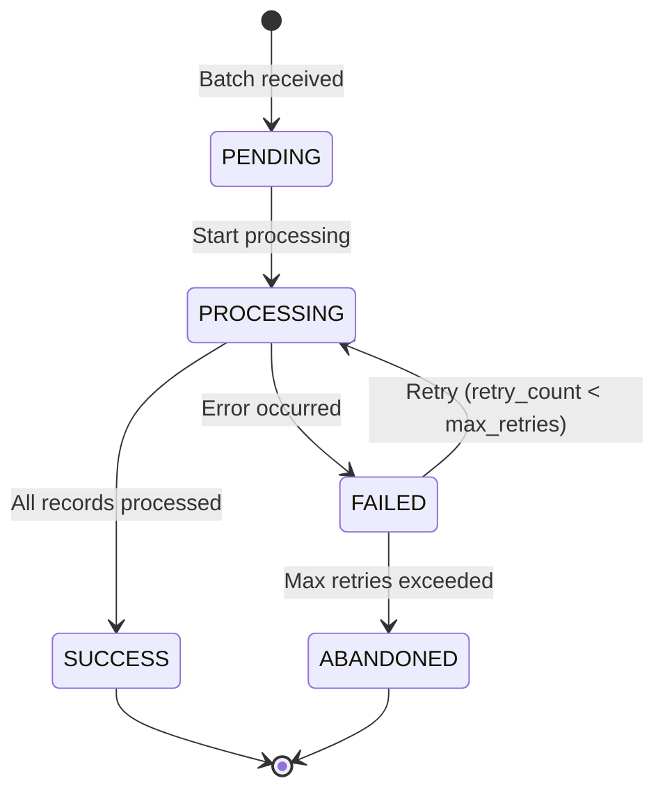
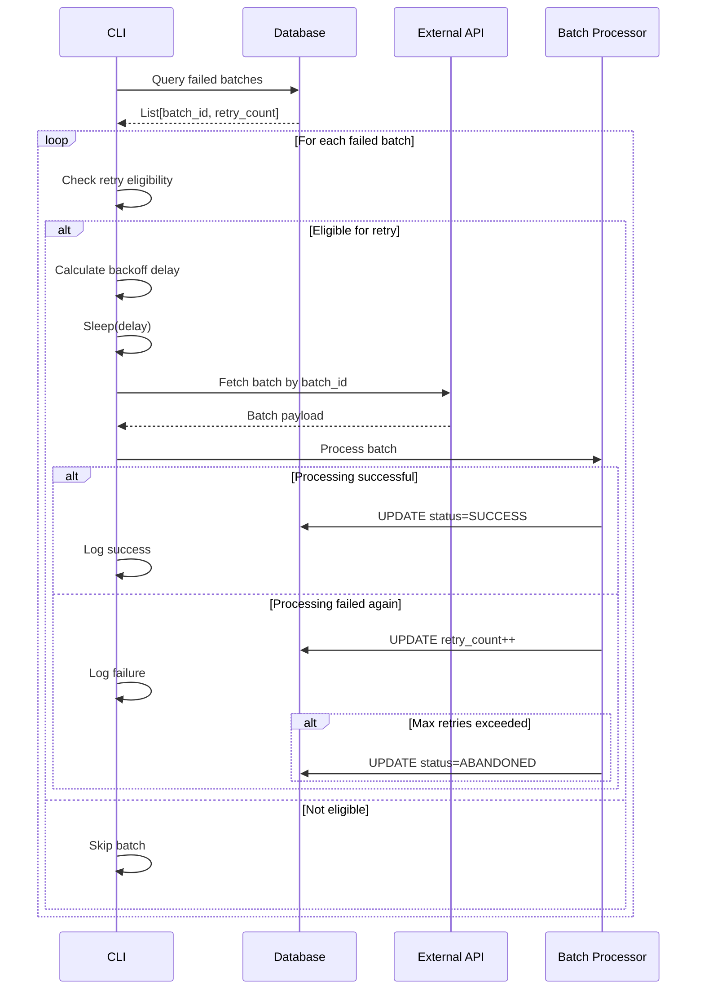

# Batch Processing & Retry Logic - Nightly Batch Ingestion Service

**Version:** 1.0  
**Date:** 2026-02-06  
**Status:** Draft  
**Owner:** Platform Engineering

---

## 1. Overview

This document defines the batch processing lifecycle and retry mechanism for the nightly ingestion service. Each batch is processed independently within a database transaction, with selective retry of failed batches only.

---

## 2. Batch Processing Lifecycle

### 2.1 State Machine



### 2.2 Batch States

| State | Description | Next States | Database Action |
|-------|-------------|-------------|-----------------|
| **PENDING** | Batch fetched from API, awaiting processing | PROCESSING | None |
| **PROCESSING** | Currently being processed | SUCCESS, FAILED | BEGIN TRANSACTION |
| **SUCCESS** | All records persisted successfully | *(terminal)* | COMMIT |
| **FAILED** | Processing error occurred | PROCESSING (retry), ABANDONED | ROLLBACK |
| **ABANDONED** | Max retries exceeded | *(terminal)* | None |

---

## 3. Batch Isolation

### 3.1 Transaction Boundaries

```python
from sqlalchemy import create_engine

def process_batch(batch_id: str, team_members: list, db_url: str):
    """
    Process single batch within isolated transaction.
    
    Transaction boundary ensures:
    - Atomicity: All-or-nothing persistence
    - Isolation: No interference between batches
    - Rollback on any error
    """
    engine = create_engine(db_url)
    
    with engine.begin() as conn:  # Auto-commit on success, rollback on exception
        try:
            # Update state to PROCESSING
            update_batch_state(conn, batch_id, status="PROCESSING")
            
            # Process all team members in batch
            for member in team_members:
                upsert_team_member(conn, member)
                upsert_skills(conn, member)
                upsert_allocations(conn, member)
                upsert_certifications(conn, member)
            
            # Update state to SUCCESS
            update_batch_state(
                conn,
                batch_id,
                status="SUCCESS",
                processed_records=len(team_members),
                completed_at=datetime.utcnow()
            )
            
            # Transaction commits here automatically
            
        except Exception as e:
            # Transaction rolls back here automatically
            # Update state tracked in separate transaction
            mark_batch_failed(batch_id, str(e))
            raise


def mark_batch_failed(batch_id: str, error_message: str):
    """Update batch state in separate transaction (survives rollback)."""
    engine = create_engine(db_url)
    with engine.begin() as conn:
        update_batch_state(
            conn,
            batch_id,
            status="FAILED",
            error_message=error_message,
            retry_count=conn.execute(
                select(ingestion_batch_state.c.retry_count)
                .where(ingestion_batch_state.c.batch_id == batch_id)
            ).scalar() + 1,
            last_retry_at=datetime.utcnow()
        )
```

### 3.2 Batch Independence

```python
def process_all_batches(payload: dict) -> tuple[int, int]:
    """
    Process all batches sequentially with isolation.
    
    Returns:
        (successful_count, failed_count)
    """
    successful = 0
    failed = 0
    
    for batch in extract_batches(payload):
        try:
            process_batch(batch["batch_id"], batch["team_members"], db_url)
            successful += 1
            print(f"✓ Batch {batch['batch_id']} completed successfully")
            
        except Exception as e:
            failed += 1
            print(f"✗ Batch {batch['batch_id']} failed: {e}")
            # Continue processing remaining batches
    
    return successful, failed
```

---

## 4. Idempotency Guarantees

### 4.1 Idempotency Mechanisms

| Mechanism | Implementation | Purpose |
|-----------|----------------|---------|
| **Natural Keys** | UPSERT with ON CONFLICT | Prevent duplicate records |
| **Batch State Tracking** | Check status before processing | Skip already-successful batches |
| **Deterministic UPSERT** | Same input → Same database state | Re-running safe |

### 4.2 Idempotent Processing

```python
def process_batch_idempotent(batch_id: str, team_members: list):
    """
    Process batch idempotently (safe to re-run).
    
    Idempotency checks:
    1. Skip if already successful
    2. UPSERT semantics for all database writes
    3. Deterministic field mappings
    """
    with engine.begin() as conn:
        # Check if already processed
        current_status = conn.execute(
            select(ingestion_batch_state.c.status)
            .where(ingestion_batch_state.c.batch_id == batch_id)
        ).scalar()
        
        if current_status == "SUCCESS":
            print(f"Batch {batch_id} already successful, skipping")
            return
        
        # Process batch (UPSERT operations ensure idempotency)
        for member in team_members:
            # ON CONFLICT DO UPDATE ensures same result on re-run
            upsert_team_member(conn, member)
            upsert_skills(conn, member)
        
        update_batch_state(conn, batch_id, status="SUCCESS")
```

### 4.3 Testing Idempotency

```python
def test_idempotent_processing():
    """Test that processing same batch twice produces identical result."""
    batch_id = "TEST-BATCH-001"
    team_members = [{"team_member_id": "TM001", ...}]
    
    # Process first time
    process_batch(batch_id, team_members, db_url)
    snapshot1 = get_database_snapshot(db_url)
    
    # Process second time (should be no-op)
    process_batch(batch_id, team_members, db_url)
    snapshot2 = get_database_snapshot(db_url)
    
    assert snapshot1 == snapshot2, "Idempotency violation detected"
```

---

## 5. Retry Strategy

### 5.1 Retry Decision Logic

```python
def should_retry_batch(batch_id: str) -> bool:
    """
    Determine if batch is eligible for retry.
    
    Retry conditions:
    - Status is FAILED
    - retry_count < max_retries
    - Error is retryable (not a validation error)
    """
    with engine.connect() as conn:
        row = conn.execute(
            select(
                ingestion_batch_state.c.status,
                ingestion_batch_state.c.retry_count,
                ingestion_batch_state.c.max_retries,
                ingestion_batch_state.c.error_message
            ).where(ingestion_batch_state.c.batch_id == batch_id)
        ).first()
        
        if not row or row.status != "FAILED":
            return False
        
        if row.retry_count >= row.max_retries:
            print(f"Batch {batch_id} exceeded max retries ({row.max_retries})")
            return False
        
        # Check if error is retryable
        if is_validation_error(row.error_message):
            print(f"Batch {batch_id} has validation error (not retryable)")
            return False
        
        return True


def is_validation_error(error_message: str) -> bool:
    """Classify error as validation error (non-retryable)."""
    validation_keywords = [
        "validation error",
        "invalid field",
        "missing required field",
        "constraint violation"
    ]
    return any(keyword in error_message.lower() for keyword in validation_keywords)
```

### 5.2 Exponential Backoff

```python
def calculate_retry_delay(retry_count: int, base_delay: int = 60) -> int:
    """
    Calculate exponential backoff delay.
    
    Formula: base_delay * 2^(retry_count - 1)
    
    Example:
        Retry 1: 60s
        Retry 2: 120s
        Retry 3: 240s
    """
    return base_delay * (2 ** (retry_count - 1))


def retry_failed_batches(max_retries: int = 3):
    """
    Retry all failed batches with exponential backoff.
    
    CLI invocation:
        ./ingest_team_data.py --retry-failed
    """
    failed_batches = get_failed_batches()
    
    print(f"Found {len(failed_batches)} failed batches")
    
    for batch in failed_batches:
        if not should_retry_batch(batch["batch_id"]):
            continue
        
        retry_count = batch["retry_count"] + 1
        delay = calculate_retry_delay(retry_count)
        
        print(f"\nRetrying batch {batch['batch_id']} (attempt {retry_count})")
        print(f"Waiting {delay}s before retry...")
        time.sleep(delay)
        
        try:
            # Fetch batch data again from external API
            payload = api_client.fetch_batch_by_id(batch["batch_id"])
            
            # Process batch
            process_batch(
                batch["batch_id"],
                payload["team_members"],
                db_url
            )
            
            print(f"✓ Batch {batch['batch_id']} retry successful")
            
        except Exception as e:
            print(f"✗ Batch {batch['batch_id']} retry failed: {e}")
            
            if retry_count >= max_retries:
                mark_batch_abandoned(batch["batch_id"])
```

### 5.3 Retry Workflow



---

## 6. Batch State Management

### 6.1 State Tracking

```python
def initialize_batch_state(batch_id: str, total_records: int, correlation_id: str):
    """Initialize batch state when first encountered."""
    stmt = insert(ingestion_batch_state).values(
        batch_id=batch_id,
        status="PENDING",
        total_records=total_records,
        correlation_id=correlation_id,
        first_attempted_at=datetime.utcnow()
    ).on_conflict_do_nothing(
        index_elements=["batch_id"]
    )
    conn.execute(stmt)


def update_batch_state(conn, batch_id: str, **kwargs):
    """Update batch state fields."""
    stmt = (
        update(ingestion_batch_state)
        .where(ingestion_batch_state.c.batch_id == batch_id)
        .values(**kwargs)
    )
    conn.execute(stmt)


def get_failed_batches() -> list:
    """Query all failed batches eligible for retry."""
    with engine.connect() as conn:
        result = conn.execute(
            select(ingestion_batch_state)
            .where(ingestion_batch_state.c.status == "FAILED")
            .where(ingestion_batch_state.c.retry_count < ingestion_batch_state.c.max_retries)
            .order_by(ingestion_batch_state.c.first_attempted_at)
        )
        return [dict(row) for row in result]
```

---

## 7. Error Recovery

### 7.1 Partial Batch Failure

```python
def process_batch_with_record_level_error_handling(batch_id: str, team_members: list):
    """
    Process batch with record-level error isolation.
    
    Strategy:
    - Continue processing remaining records if one fails
    - Track failed vs. successful record counts
    - Mark batch as PARTIAL_SUCCESS if any records succeed
    """
    successful_records = 0
    failed_records = 0
    errors = []
    
    with engine.begin() as conn:
        for member in team_members:
            try:
                upsert_team_member(conn, member)
                upsert_skills(conn, member)
                successful_records += 1
                
            except Exception as e:
                failed_records += 1
                errors.append({
                    "team_member_id": member["team_member_id"],
                    "error": str(e)
                })
                # Continue processing next record
        
        # Determine final status
        if failed_records == 0:
            status = "SUCCESS"
        elif successful_records == 0:
            status = "FAILED"
        else:
            status = "PARTIAL_SUCCESS"
        
        update_batch_state(
            conn,
            batch_id,
            status=status,
            processed_records=successful_records,
            failed_records=failed_records,
            error_message=json.dumps(errors) if errors else None
        )
```

### 7.2 Dead Letter Queue

```python
def move_to_dead_letter_queue(batch_id: str):
    """
    Move abandoned batch to dead letter queue for manual review.
    
    Dead letter queue table:
    - batch_id
    - original_payload (JSONB)
    - error_history (JSONB)
    - abandoned_at (TIMESTAMP)
    """
    with engine.begin() as conn:
        # Retrieve original batch data
        batch_state = conn.execute(
            select(ingestion_batch_state)
            .where(ingestion_batch_state.c.batch_id == batch_id)
        ).first()
        
        # Insert into DLQ
        conn.execute(
            insert(dead_letter_queue).values(
                batch_id=batch_id,
                error_history=batch_state.error_message,
                abandoned_at=datetime.utcnow()
            )
        )
        
        # Update batch state
        update_batch_state(
            conn,
            batch_id,
            status="ABANDONED"
        )
```

---

## 8. Performance Optimization

### 8.1 Batch Size Tuning

```python
# Recommended batch size: 50-100 records per batch
# Trade-offs:
# - Smaller batches: Faster rollback, better isolation, more network overhead
# - Larger batches: Better throughput, longer rollback time, memory pressure

OPTIMAL_BATCH_SIZE = 100  # Records per batch
MAX_BATCH_SIZE = 500      # Hard limit to prevent OOM
```

### 8.2 Parallel Batch Processing (Future Enhancement)

```python
from concurrent.futures import ThreadPoolExecutor, as_completed

def process_batches_parallel(batches: list, max_workers: int = 5):
    """
    Process multiple batches in parallel (future enhancement).
    
    Considerations:
    - Database connection pool must support concurrent connections
    - Batches must be truly independent (no shared state)
    - Error in one batch should not affect others
    """
    with ThreadPoolExecutor(max_workers=max_workers) as executor:
        futures = {
            executor.submit(process_batch, batch["batch_id"], batch["team_members"]): batch["batch_id"]
            for batch in batches
        }
        
        for future in as_completed(futures):
            batch_id = futures[future]
            try:
                future.result()
                print(f"✓ Batch {batch_id} completed")
            except Exception as e:
                print(f"✗ Batch {batch_id} failed: {e}")
```

---

## 9. Monitoring and Alerts

### 9.1 Key Metrics

```python
class BatchProcessingMetrics:
    """Track batch processing metrics."""
    
    def __init__(self):
        self.total_batches = 0
        self.successful_batches = 0
        self.failed_batches = 0
        self.abandoned_batches = 0
        self.total_records_processed = 0
        self.total_processing_time_ms = 0
    
    def get_summary(self) -> dict:
        return {
            "total_batches": self.total_batches,
            "success_rate": self.successful_batches / max(self.total_batches, 1),
            "failure_rate": self.failed_batches / max(self.total_batches, 1),
            "avg_batch_time_ms": self.total_processing_time_ms / max(self.total_batches, 1),
            "abandoned_batches": self.abandoned_batches
        }
```

### 9.2 Alert Conditions

| Condition | Severity | Action |
|-----------|----------|--------|
| All batches failed | Critical | Page on-call engineer |
| >20% batch failure rate | Warning | Create incident ticket |
| Batch abandoned | Warning | Manual review required |
| Retry attempts exceeded | Info | Investigate data quality |
| Avg batch time > 5 minutes | Warning | Performance investigation |

---

## 10. Definition of Done

- [ ] Batch processor with transaction isolation implemented
- [ ] Idempotency tests passing
- [ ] Retry logic with exponential backoff
- [ ] Batch state tracking in database
- [ ] CLI support for `--retry-failed` flag
- [ ] Dead letter queue for abandoned batches
- [ ] Metrics collection and logging
- [ ] Performance benchmarks met
- [ ] Runbook for manual batch recovery

---

**Document Status:** Ready for Implementation  
**Next Steps:** Implement batch processor with transaction management and retry logic
