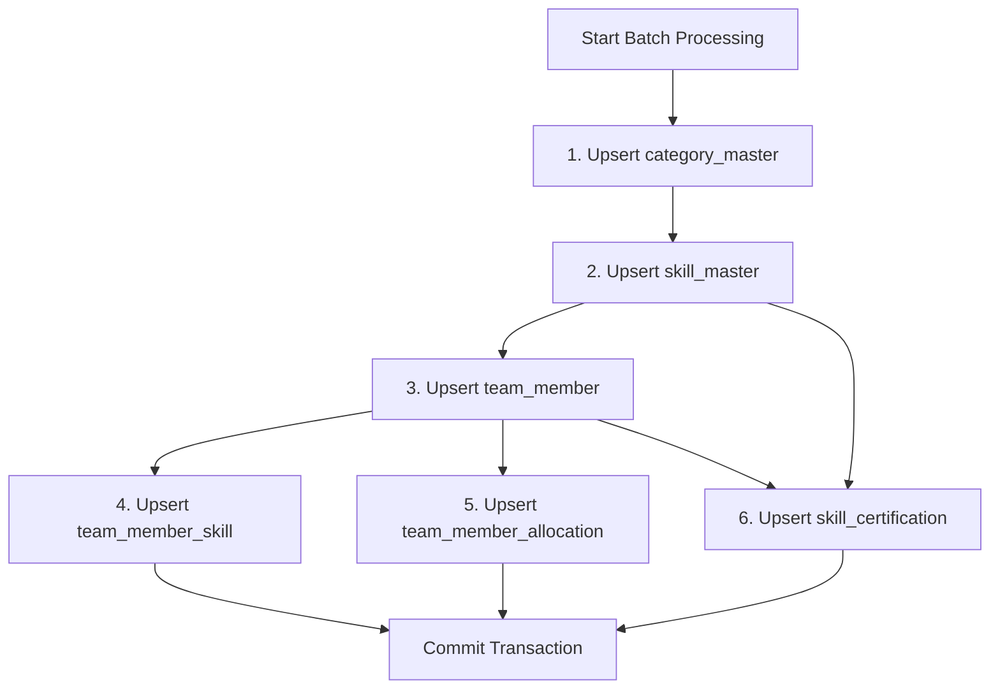

# Database Mapping - Nightly Batch Ingestion Service

**Version:** 1.0  
**Date:** 2026-02-06  
**Status:** Draft  
**Owner:** Platform Engineering

---

## 1. Overview

This document defines the mapping between external API payload and database tables for the nightly batch ingestion service. All mappings are implemented using SQLAlchemy Core with UPSERT semantics to ensure idempotency.

---

## 2. Payload Structure

### 2.1 External API Response Schema

```json
{
  "metadata": {
    "batch_id": "BATCH-2026-02-06-001",
    "timestamp": "2026-02-06T02:00:00Z",
    "total_records": 150,
    "batch_number": 1,
    "total_batches": 3,
    "records_in_batch": 50,
    "source_system": "HRIS",
    "schema_version": "1.0",
    "status": {
      "code": 200,
      "key": "SUCCESS",
      "message": "Batch data retrieved successfully"
    }
  },
  "team_members": [
    {
      "team_member_id": "TM001",
      "team_member_status": "active",
      "experience_in_months": 60,
      "full_name": "John Doe",
      "designation": "Senior Software Engineer",
      "profile_type": "Technical",
      "base_location": "Bangalore",
      "work_type": "Hybrid",
      "profile_url": "https://internal-portal.example.com/profiles/TM001",
      "skills": [
        {
          "skill_id": "SKILL001",
          "skill_name": "Python",
          "category_name": "Programming Languages",
          "rating": 9,
          "experience_in_months": 48,
          "is_primary": true
        },
        {
          "skill_id": "SKILL002",
          "skill_name": "FastAPI",
          "category_name": "Frameworks",
          "rating": 8,
          "experience_in_months": 24,
          "is_primary": false
        }
      ],
      "allocations": [
        {
          "project_id": "PROJ001",
          "allocation_percentage": 80.0,
          "start_date": "2026-01-01",
          "end_date": "2026-06-30"
        }
      ],
      "certifications": [
        {
          "skill_id": "SKILL001",
          "certification_name": "Python Professional Certification",
          "issued_by": "Python Institute",
          "issued_date": "2024-03-15",
          "expiry_date": "2027-03-15",
          "certification_url": "https://certifications.example.com/cert123"
        }
      ]
    }
  ]
}
```

---

## 3. Database Schema

### 3.1 Target Tables

```sql
-- 1. category_master (lookup table)
CREATE TABLE category_master (
    category_id SERIAL PRIMARY KEY,
    category_name VARCHAR(100) NOT NULL UNIQUE,
    created_at TIMESTAMP DEFAULT NOW()
);

-- 2. skill_master (depends on category_master)
CREATE TABLE skill_master (
    skill_id VARCHAR(50) PRIMARY KEY,
    skill_name VARCHAR(200) NOT NULL,
    category_id INTEGER REFERENCES category_master(category_id),
    created_at TIMESTAMP DEFAULT NOW()
);

-- 3. team_member (independent)
CREATE TABLE team_member (
    team_member_id VARCHAR(50) PRIMARY KEY,
    designation VARCHAR(100),
    profile_type VARCHAR(50),
    is_active BOOLEAN DEFAULT TRUE,
    experience_in_months INTEGER,
    base_location VARCHAR(100),
    work_type VARCHAR(20),  -- Enum: 'wfo', 'wfh', 'hybrid'
    profile_url VARCHAR(1024),
    created_at TIMESTAMP DEFAULT NOW()
);

-- 4. team_member_skill (depends on team_member + skill_master)
CREATE TABLE team_member_skill (
    team_member_id VARCHAR(50) REFERENCES team_member(team_member_id),
    skill_id VARCHAR(50) REFERENCES skill_master(skill_id),
    rating INTEGER CHECK (rating >= 1 AND rating <= 10),
    experience_in_months INTEGER,
    is_primary BOOLEAN DEFAULT FALSE,
    created_at TIMESTAMP DEFAULT NOW(),
    PRIMARY KEY (team_member_id, skill_id)
);

-- 5. team_member_allocation (depends on team_member)
CREATE TABLE team_member_allocation (
    allocation_id SERIAL PRIMARY KEY,
    team_member_id VARCHAR(50) REFERENCES team_member(team_member_id),
    project_id VARCHAR(50) NOT NULL,
    allocation_percentage DECIMAL(5, 2) CHECK (allocation_percentage >= 0 AND allocation_percentage <= 100),
    start_date DATE NOT NULL,
    end_date DATE,
    created_at TIMESTAMP DEFAULT NOW(),
    UNIQUE (team_member_id, project_id, start_date)
);

-- 6. skill_certification (depends on team_member + skill_master)
CREATE TABLE skill_certification (
    certification_id SERIAL PRIMARY KEY,
    team_member_id VARCHAR(50) REFERENCES team_member(team_member_id),
    skill_id VARCHAR(50) REFERENCES skill_master(skill_id),
    certification_name VARCHAR(200) NOT NULL,
    issued_by VARCHAR(200),
    issued_date DATE,
    expiry_date DATE,
    certification_url VARCHAR(1024),
    created_at TIMESTAMP DEFAULT NOW(),
    UNIQUE (team_member_id, skill_id, certification_name)
);
```

---

## 4. Mapping Rules

### 4.1 Processing Order (Maintains Referential Integrity)



### 4.2 Natural Keys (Idempotency)

| Table | Natural Key | Conflict Strategy |
|-------|-------------|-------------------|
| **category_master** | `category_name` | UPSERT (ON CONFLICT DO NOTHING) |
| **skill_master** | `skill_id` | UPSERT (ON CONFLICT UPDATE category_id, skill_name) |
| **team_member** | `team_member_id` | UPSERT (ON CONFLICT UPDATE all fields) |
| **team_member_skill** | `(team_member_id, skill_id)` | UPSERT (ON CONFLICT UPDATE rating, experience) |
| **team_member_allocation** | `(team_member_id, project_id, start_date)` | UPSERT (ON CONFLICT UPDATE allocation_percentage, end_date) |
| **skill_certification** | `(team_member_id, skill_id, certification_name)` | UPSERT (ON CONFLICT UPDATE issued_by, dates, url) |

---

## 5. Field-Level Mappings

### 5.1 Payload → category_master

```python
# Extract unique categories from all skills
categories = set()
for member in payload["team_members"]:
    for skill in member.get("skills", []):
        categories.add(skill["category_name"])

# Upsert each category
for category_name in categories:
    stmt = insert(category_master).values(
        category_name=category_name
    ).on_conflict_do_nothing(
        index_elements=["category_name"]
    )
    conn.execute(stmt)
```

| Payload Field | Database Field | Transformation | Notes |
|---------------|----------------|----------------|-------|
| `skills[].category_name` | `category_name` | None | Unique constraint ensures deduplication |

### 5.2 Payload → skill_master

```python
for member in payload["team_members"]:
    for skill in member.get("skills", []):
        # Lookup category_id
        category_id = conn.execute(
            select(category_master.c.category_id)
            .where(category_master.c.category_name == skill["category_name"])
        ).scalar_one()
        
        # Upsert skill
        stmt = insert(skill_master).values(
            skill_id=skill["skill_id"],
            skill_name=skill["skill_name"],
            category_id=category_id
        ).on_conflict_do_update(
            index_elements=["skill_id"],
            set_={
                "skill_name": skill["skill_name"],
                "category_id": category_id
            }
        )
        conn.execute(stmt)
```

| Payload Field | Database Field | Transformation | Notes |
|---------------|----------------|----------------|-------|
| `skills[].skill_id` | `skill_id` | None | Primary key |
| `skills[].skill_name` | `skill_name` | None | Updated on conflict |
| `skills[].category_name` | `category_id` | Lookup via `category_master` | Foreign key |

### 5.3 Payload → team_member

```python
for member in payload["team_members"]:
    stmt = insert(team_member).values(
        team_member_id=member["team_member_id"],
        designation=member.get("designation"),
        profile_type=member.get("profile_type"),
        is_active=(member["team_member_status"] == "active"),
        experience_in_months=member["experience_in_months"],
        base_location=member.get("base_location"),
        work_type=member.get("work_type"),
        profile_url=member.get("profile_url")
    ).on_conflict_do_update(
        index_elements=["team_member_id"],
        set_={
            "designation": member.get("designation"),
            "profile_type": member.get("profile_type"),
            "is_active": (member["team_member_status"] == "active"),
            "experience_in_months": member["experience_in_months"],
            "base_location": member.get("base_location"),
            "work_type": member.get("work_type"),
            "profile_url": member.get("profile_url")
        }
    )
    conn.execute(stmt)
```

| Payload Field | Database Field | Transformation | Notes |
|---------------|----------------|----------------|-------|
| `team_member_id` | `team_member_id` | None | Primary key |
| `designation` | `designation` | None | Nullable |
| `profile_type` | `profile_type` | None | Nullable |
| `team_member_status` | `is_active` | `"active" → TRUE` | Boolean conversion |
| `experience_in_months` | `experience_in_months` | None | Required |
| `base_location` | `base_location` | None | Nullable |
| `work_type` | `work_type` | Lowercase | Enum: 'wfo', 'wfh', 'hybrid' |
| `profile_url` | `profile_url` | None | Nullable |
| `full_name` | *(not stored)* | N/A | Not required by database schema |

### 5.4 Payload → team_member_skill

```python
for member in payload["team_members"]:
    for skill in member.get("skills", []):
        stmt = insert(team_member_skill).values(
            team_member_id=member["team_member_id"],
            skill_id=skill["skill_id"],
            rating=skill["rating"],
            experience_in_months=skill.get("experience_in_months"),
            is_primary=skill.get("is_primary", False)
        ).on_conflict_do_update(
            index_elements=["team_member_id", "skill_id"],
            set_={
                "rating": skill["rating"],
                "experience_in_months": skill.get("experience_in_months"),
                "is_primary": skill.get("is_primary", False)
            }
        )
        conn.execute(stmt)
```

| Payload Field | Database Field | Transformation | Notes |
|---------------|----------------|----------------|-------|
| `team_member_id` | `team_member_id` | None | FK to team_member |
| `skills[].skill_id` | `skill_id` | None | FK to skill_master |
| `skills[].rating` | `rating` | None | Range: 1-10 |
| `skills[].experience_in_months` | `experience_in_months` | None | Nullable |
| `skills[].is_primary` | `is_primary` | Default `FALSE` | Boolean |

### 5.5 Payload → team_member_allocation

```python
for member in payload["team_members"]:
    for allocation in member.get("allocations", []):
        stmt = insert(team_member_allocation).values(
            team_member_id=member["team_member_id"],
            project_id=allocation["project_id"],
            allocation_percentage=allocation["allocation_percentage"],
            start_date=allocation["start_date"],
            end_date=allocation.get("end_date")
        ).on_conflict_do_update(
            index_elements=["team_member_id", "project_id", "start_date"],
            set_={
                "allocation_percentage": allocation["allocation_percentage"],
                "end_date": allocation.get("end_date")
            }
        )
        conn.execute(stmt)
```

| Payload Field | Database Field | Transformation | Notes |
|---------------|----------------|----------------|-------|
| `team_member_id` | `team_member_id` | None | FK to team_member |
| `allocations[].project_id` | `project_id` | None | External project reference |
| `allocations[].allocation_percentage` | `allocation_percentage` | None | Range: 0-100 |
| `allocations[].start_date` | `start_date` | None | ISO 8601 date |
| `allocations[].end_date` | `end_date` | None | Nullable |

### 5.6 Payload → skill_certification

```python
for member in payload["team_members"]:
    for cert in member.get("certifications", []):
        stmt = insert(skill_certification).values(
            team_member_id=member["team_member_id"],
            skill_id=cert["skill_id"],
            certification_name=cert["certification_name"],
            issued_by=cert.get("issued_by"),
            issued_date=cert.get("issued_date"),
            expiry_date=cert.get("expiry_date"),
            certification_url=cert.get("certification_url")
        ).on_conflict_do_update(
            index_elements=["team_member_id", "skill_id", "certification_name"],
            set_={
                "issued_by": cert.get("issued_by"),
                "issued_date": cert.get("issued_date"),
                "expiry_date": cert.get("expiry_date"),
                "certification_url": cert.get("certification_url")
            }
        )
        conn.execute(stmt)
```

| Payload Field | Database Field | Transformation | Notes |
|---------------|----------------|----------------|-------|
| `team_member_id` | `team_member_id` | None | FK to team_member |
| `certifications[].skill_id` | `skill_id` | None | FK to skill_master |
| `certifications[].certification_name` | `certification_name` | None | Part of unique constraint |
| `certifications[].issued_by` | `issued_by` | None | Nullable |
| `certifications[].issued_date` | `issued_date` | None | ISO 8601 date, nullable |
| `certifications[].expiry_date` | `expiry_date` | None | ISO 8601 date, nullable |
| `certifications[].certification_url` | `certification_url` | None | Nullable |

---

## 6. UPSERT Implementation

### 6.1 SQLAlchemy Core Example

```python
from sqlalchemy import insert, select
from sqlalchemy.dialects.postgresql import insert as pg_insert

def upsert_team_member(conn, member_data: dict):
    """
    Upsert team member with conflict handling.
    
    Args:
        conn: SQLAlchemy connection
        member_data: Parsed member data from payload
    """
    stmt = pg_insert(team_member).values(
        team_member_id=member_data["team_member_id"],
        designation=member_data.get("designation"),
        profile_type=member_data.get("profile_type"),
        is_active=(member_data["team_member_status"] == "active"),
        experience_in_months=member_data["experience_in_months"],
        base_location=member_data.get("base_location"),
        work_type=member_data.get("work_type", "").lower() if member_data.get("work_type") else None,
        profile_url=member_data.get("profile_url")
    )
    
    # Define conflict resolution
    update_dict = {
        "designation": stmt.excluded.designation,
        "profile_type": stmt.excluded.profile_type,
        "is_active": stmt.excluded.is_active,
        "experience_in_months": stmt.excluded.experience_in_months,
        "base_location": stmt.excluded.base_location,
        "work_type": stmt.excluded.work_type,
        "profile_url": stmt.excluded.profile_url
    }
    
    stmt = stmt.on_conflict_do_update(
        index_elements=["team_member_id"],
        set_=update_dict
    )
    
    conn.execute(stmt)
```

### 6.2 Batch UPSERT Pattern

```python
def upsert_team_member_skills_batch(conn, team_member_id: str, skills: list):
    """
    Batch upsert all skills for a team member.
    
    Args:
        conn: SQLAlchemy connection
        team_member_id: Team member identifier
        skills: List of skill dictionaries
    """
    if not skills:
        return
    
    # Prepare batch values
    values = [
        {
            "team_member_id": team_member_id,
            "skill_id": skill["skill_id"],
            "rating": skill["rating"],
            "experience_in_months": skill.get("experience_in_months"),
            "is_primary": skill.get("is_primary", False)
        }
        for skill in skills
    ]
    
    # Execute batch UPSERT
    stmt = pg_insert(team_member_skill).values(values)
    stmt = stmt.on_conflict_do_update(
        index_elements=["team_member_id", "skill_id"],
        set_={
            "rating": stmt.excluded.rating,
            "experience_in_months": stmt.excluded.experience_in_months,
            "is_primary": stmt.excluded.is_primary
        }
    )
    
    conn.execute(stmt)
```

---

## 7. Data Validation Rules

### 7.1 Pre-Insert Validation

| Field | Validation Rule | Error Action |
|-------|----------------|--------------|
| `team_member_id` | Not null, max 50 chars | Skip record, log error |
| `team_member_status` | Must be 'active' or 'inactive' | Skip record |
| `experience_in_months` | >= 0 | Skip record |
| `skills[].rating` | 1-10 inclusive | Clamp to range or skip |
| `allocations[].allocation_percentage` | 0-100 inclusive | Skip record |
| `allocations[].start_date` | Valid date, not future | Skip record |
| `skills[].skill_id` | Not null, max 50 chars | Skip skill |
| `work_type` | Must be 'wfo', 'wfh', 'hybrid', or null | Normalize to lowercase or null |

### 7.2 Validation Implementation

```python
def validate_team_member(member: dict) -> tuple[bool, list[str]]:
    """
    Validate team member data before insertion.
    
    Returns:
        (is_valid, errors)
    """
    errors = []
    
    if not member.get("team_member_id"):
        errors.append("team_member_id is required")
    
    if member["team_member_status"] not in ["active", "inactive"]:
        errors.append(f"Invalid team_member_status: {member['team_member_status']}")
    
    if member["experience_in_months"] < 0:
        errors.append("experience_in_months cannot be negative")
    
    # Validate skills
    for skill in member.get("skills", []):
        if not skill.get("skill_id"):
            errors.append(f"skill_id missing for skill: {skill.get('skill_name')}")
        if not (1 <= skill.get("rating", 0) <= 10):
            errors.append(f"Invalid rating for skill {skill.get('skill_id')}: {skill.get('rating')}")
    
    # Validate allocations
    for alloc in member.get("allocations", []):
        if not (0 <= alloc.get("allocation_percentage", -1) <= 100):
            errors.append(f"Invalid allocation_percentage: {alloc.get('allocation_percentage')}")
    
    return (len(errors) == 0, errors)
```

---

## 8. Handling Missing or Null Values

### 8.1 Nullable Fields Strategy

| Field | If Missing/Null | Action |
|-------|-----------------|--------|
| `designation` | NULL | Store as NULL (allowed) |
| `profile_type` | NULL | Store as NULL (allowed) |
| `base_location` | NULL | Store as NULL (allowed) |
| `work_type` | NULL | Store as NULL (allowed) |
| `profile_url` | NULL | Store as NULL (allowed) |
| `skills[].experience_in_months` | NULL | Store as NULL (allowed) |
| `skills[].is_primary` | Missing | Default to FALSE |
| `allocations[].end_date` | NULL | Store as NULL (ongoing allocation) |
| `certifications` | Missing/Empty | Skip certification processing |

### 8.2 Required Fields

If any of these are missing/null, **skip the entire record**:

- `team_member_id`
- `team_member_status`
- `experience_in_months`
- `skills[].skill_id`
- `skills[].skill_name`
- `skills[].rating`
- `allocations[].project_id`
- `allocations[].allocation_percentage`
- `allocations[].start_date`

---

## 9. Foreign Key Handling

### 9.1 Missing Foreign Key References

```python
def safe_upsert_team_member_skill(conn, team_member_id: str, skill: dict):
    """
    Upsert team member skill with foreign key validation.
    
    Raises:
        ValueError: If team_member or skill_master does not exist
    """
    # Validate team_member exists
    tm_exists = conn.execute(
        select(team_member.c.team_member_id)
        .where(team_member.c.team_member_id == team_member_id)
    ).first()
    
    if not tm_exists:
        raise ValueError(f"team_member {team_member_id} does not exist")
    
    # Validate skill_master exists
    skill_exists = conn.execute(
        select(skill_master.c.skill_id)
        .where(skill_master.c.skill_id == skill["skill_id"])
    ).first()
    
    if not skill_exists:
        raise ValueError(f"skill_master {skill['skill_id']} does not exist")
    
    # Proceed with UPSERT
    stmt = pg_insert(team_member_skill).values(...)
    conn.execute(stmt)
```

### 9.2 Cascading Updates

If external system changes `skill_id`:

```python
# Old approach: Manual cleanup
conn.execute(
    delete(team_member_skill)
    .where(team_member_skill.c.team_member_id == team_member_id)
)

# New approach: Let UPSERT handle it naturally
# Only current skills from payload are upserted
# Stale skills remain but can be identified by absence in latest batch
```

**Alternative Strategy**: Add `last_seen_batch_id` column to track active vs. stale records.

---

## 10. Performance Optimization

### 10.1 Bulk Operations

```python
# ❌ Inefficient: Row-by-row inserts
for member in payload["team_members"]:
    conn.execute(insert(team_member).values(...))

# ✅ Efficient: Batch insert
values = [prepare_member_values(m) for m in payload["team_members"]]
conn.execute(insert(team_member), values)
```

### 10.2 Index Usage

```sql
-- Ensure indexes exist for UPSERT conflict detection
CREATE UNIQUE INDEX idx_team_member_pk ON team_member(team_member_id);
CREATE UNIQUE INDEX idx_skill_master_pk ON skill_master(skill_id);
CREATE UNIQUE INDEX idx_team_member_skill_pk ON team_member_skill(team_member_id, skill_id);
CREATE UNIQUE INDEX idx_category_master_name ON category_master(category_name);
CREATE UNIQUE INDEX idx_allocation_unique ON team_member_allocation(team_member_id, project_id, start_date);
```

---

## 11. Example: Complete Batch Processing

```python
from sqlalchemy import create_engine, select, insert
from sqlalchemy.dialects.postgresql import insert as pg_insert

def process_batch(payload: dict, database_url: str):
    """
    Process a single batch of team member data.
    
    Args:
        payload: Parsed JSON payload from external API
        database_url: PostgreSQL connection string
    """
    engine = create_engine(database_url)
    
    with engine.begin() as conn:  # Auto-commit on success, rollback on error
        batch_id = payload["metadata"]["batch_id"]
        
        # Step 1: Upsert categories
        categories = extract_unique_categories(payload)
        upsert_categories(conn, categories)
        
        # Step 2: Upsert skills
        skills = extract_unique_skills(payload)
        upsert_skills(conn, skills)
        
        # Step 3-6: Process each team member
        for member in payload["team_members"]:
            # Step 3: Upsert team member
            upsert_team_member(conn, member)
            
            # Step 4: Upsert team member skills
            if member.get("skills"):
                upsert_team_member_skills_batch(conn, member["team_member_id"], member["skills"])
            
            # Step 5: Upsert allocations
            if member.get("allocations"):
                upsert_allocations(conn, member["team_member_id"], member["allocations"])
            
            # Step 6: Upsert certifications
            if member.get("certifications"):
                upsert_certifications(conn, member["team_member_id"], member["certifications"])
        
        # Update batch state
        update_batch_state(conn, batch_id, status="SUCCESS")

def extract_unique_categories(payload: dict) -> set:
    """Extract unique category names from payload."""
    categories = set()
    for member in payload["team_members"]:
        for skill in member.get("skills", []):
            if skill.get("category_name"):
                categories.add(skill["category_name"])
    return categories

def upsert_categories(conn, categories: set):
    """Upsert category_master records."""
    for category_name in categories:
        stmt = pg_insert(category_master).values(
            category_name=category_name
        ).on_conflict_do_nothing(
            index_elements=["category_name"]
        )
        conn.execute(stmt)
```

---

## 12. Data Quality Checks

### 12.1 Post-Ingestion Validation Queries

```sql
-- Check for orphaned team_member_skill records
SELECT tms.team_member_id, tms.skill_id
FROM team_member_skill tms
LEFT JOIN team_member tm ON tms.team_member_id = tm.team_member_id
WHERE tm.team_member_id IS NULL;

-- Check for skills without category
SELECT skill_id, skill_name
FROM skill_master
WHERE category_id IS NULL;

-- Check for allocation percentage > 100%
SELECT team_member_id, SUM(allocation_percentage) AS total_allocation
FROM team_member_allocation
WHERE end_date IS NULL OR end_date > CURRENT_DATE
GROUP BY team_member_id
HAVING SUM(allocation_percentage) > 100;

-- Check for invalid ratings
SELECT team_member_id, skill_id, rating
FROM team_member_skill
WHERE rating NOT BETWEEN 1 AND 10;
```

### 12.2 Data Reconciliation

```sql
-- Compare record counts before and after ingestion
SELECT 
    'team_member' AS table_name,
    COUNT(*) AS record_count
FROM team_member
UNION ALL
SELECT 'team_member_skill', COUNT(*) FROM team_member_skill
UNION ALL
SELECT 'team_member_allocation', COUNT(*) FROM team_member_allocation
UNION ALL
SELECT 'skill_certification', COUNT(*) FROM skill_certification;
```

---

## 13. Definition of Done

- [ ] All payload-to-table mappings documented
- [ ] UPSERT logic implemented for all tables
- [ ] Natural keys and conflict strategies defined
- [ ] Data validation rules implemented
- [ ] Foreign key handling tested
- [ ] Batch processing order verified
- [ ] Performance benchmarks met (<5 min for 1000 records)
- [ ] Data quality checks integrated
- [ ] Example payloads tested against production-like data

---

**Document Status:** Ready for Implementation  
**Next Steps:** Implement batch processor with UPSERT operations and validation logic
