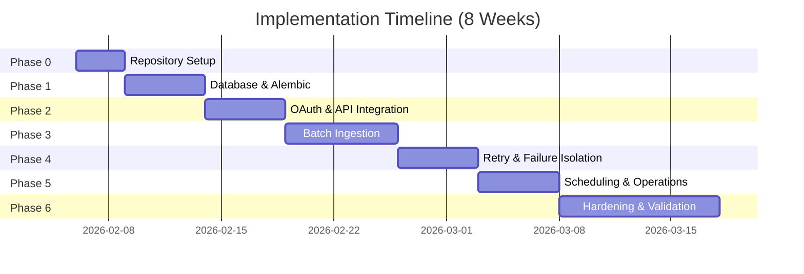

# Nightly Batch Ingestion Service - Implementation Plan

**Version:** 1.0  
**Date:** 2026-02-06  
**Status:** Ready for Execution  
**Owner:** Platform Engineering Team

---

## 📋 Executive Summary

This document provides a **phase-wise, execution-ready implementation plan** for building the Python-based nightly batch ingestion service. The plan is designed for direct conversion into engineering tickets and supports incremental delivery with clear validation checkpoints.

**System Overview:**
- **Purpose:** Nightly ingestion of team member skill & availability data from external API
- **Authentication:** OAuth 2.0 Client Credentials grant
- **Processing Model:** Batch-based with transaction isolation and selective retry
- **Schema Management:** Alembic with mandatory version validation
- **Schedule:** 2:00 AM IST daily (via cron/Kubernetes CronJob)
- **Duration Target:** < 30 minutes for 10,000 records

**Related Specifications:**
- [specs/cron/architecture.md](./architecture.md) - System architecture
- [specs/cron/alembic-migrations.md](./alembic-migrations.md) - Migration strategy
- [specs/cron/database-mapping.md](./database-mapping.md) - Payload mappings
- ~~[specs/cron/api-integration.md](./api-integration.md)~~ - **REMOVED** (OAuth & API client replaced with stubs)
- [specs/cron/batch-processing.md](./batch-processing.md) - Batch lifecycle
- [specs/cron/scheduler.md](./scheduler.md) - Scheduling configuration
- [specs/cron/error-handling.md](./error-handling.md) - Error taxonomy & logging
- [specs/cron/non-functional-requirements.md](./non-functional-requirements.md) - NFRs & SLAs

---

## 🎯 Implementation Phases



| Phase | Duration | Start Dependency | Key Deliverable |
|-------|----------|------------------|-----------------|
| **Phase 0** | 3 days | None | Repository scaffolding complete |
| **Phase 1** | 5 days | Phase 0 | Alembic migration 002 applied |
| **Phase 2** | 5 days | Phase 1 | OAuth client working with token cache |
| **Phase 3** | 7 days | Phase 2 | Batch processor with UPSERT logic |
| **Phase 4** | 5 days | Phase 3 | Retry manager with exponential backoff |
| **Phase 5** | 5 days | Phase 4 | Cron/K8s scheduler configured |
| **Phase 6** | 10 days | Phase 5 | Production-ready with monitoring |

**Total Duration:** 8 weeks  
**Team Size:** 2-3 engineers  
**Critical Path:** Phase 0 → 1 → 2 → 3 → 4 → 5 → 6

---

## Phase 0: Repository & Scaffolding

**Purpose:** Establish directory structure, dependency management, and development environment.

**Specification Reference:** [architecture.md](./architecture.md) - Section 2 (Project Structure)

**Duration:** 3 days

### Tasks

#### Task 0.1: Create Directory Structure

**Description:** Create all directories per mandatory structure.

**Location:**
```
app/cron/
├── __init__.py
├── config.py
├── main.py
├── scheduler.py
├── oauth/
│   ├── __init__.py
│   └── token_client.py
├── api/
│   ├── __init__.py
│   └── external_client.py
├── db/
│   ├── __init__.py
│   ├── engine.py
│   ├── metadata.py
│   ├── repositories.py
│   └── migrations_check.py
├── processing/
│   ├── __init__.py
│   ├── batch_processor.py
│   └── retry_manager.py
└── utils/
    ├── __init__.py
    └── logging.py
```

**Commands:**
```bash
# Create directory structure
mkdir -p app/cron/{oauth,api,db,processing,utils}
mkdir -p scripts
mkdir -p tests

# Create __init__.py files
touch app/cron/__init__.py
touch app/cron/oauth/__init__.py
touch app/cron/api/__init__.py
touch app/cron/db/__init__.py
touch app/cron/processing/__init__.py
touch app/cron/utils/__init__.py
```

**Dependencies:** None

**Deliverables:**
- Complete directory tree matching mandatory structure
- All `__init__.py` files created

**Acceptance Criteria:**
- [ ] Directory structure matches specification exactly
- [ ] All directories exist
- [ ] Python can import `app.cron` modules

---

#### Task 0.2: Configure Dependencies

**Description:** Create `requirements.txt` and `pyproject.toml` with pinned dependencies.

**Location:** `requirements.txt`, `pyproject.toml`

**Dependencies:** Task 0.1

**Deliverables:**

**requirements.txt:**
```txt
# Core dependencies
sqlalchemy==2.0.25
alembic==1.13.1
psycopg2-binary==2.9.9

# HTTP & OAuth
requests==2.31.0
authlib==1.3.0

# Utilities
python-dotenv==1.0.0
pydantic==2.5.3
pydantic-settings==2.1.0

# Logging & Monitoring
structlog==24.1.0
prometheus-client==0.19.0

# Testing
pytest==7.4.4
pytest-cov==4.1.0
pytest-mock==3.12.0
responses==0.24.1

# Development
pylint==3.0.3
black==23.12.1
mypy==1.8.0
```

**pyproject.toml:**
```toml
[project]
name = "ib-job-skill-mapping-system"
version = "1.0.0"
description = "Nightly batch ingestion service for team member skills"
requires-python = ">=3.11"
dependencies = [
    "sqlalchemy==2.0.25",
    "alembic==1.13.1",
    "psycopg2-binary==2.9.9",
    "requests==2.31.0",
    "authlib==1.3.0",
    "python-dotenv==1.0.0",
    "pydantic==2.5.3",
    "pydantic-settings==2.1.0",
    "structlog==24.1.0",
    "prometheus-client==0.19.0"
]

[project.optional-dependencies]
dev = [
    "pytest==7.4.4",
    "pytest-cov==4.1.0",
    "pytest-mock==3.12.0",
    "responses==0.24.1",
    "pylint==3.0.3",
    "black==23.12.1",
    "mypy==1.8.0"
]

[tool.black]
line-length = 100
target-version = ['py311']

[tool.pylint.messages_control]
max-line-length = 100
disable = ["C0103", "C0114"]

[tool.mypy]
python_version = "3.11"
warn_return_any = true
warn_unused_configs = true
disallow_untyped_defs = true
```

**Acceptance Criteria:**
- [ ] Dependencies installed successfully (`pip install -r requirements.txt`)
- [ ] All imports work without errors
- [ ] No security vulnerabilities (run `safety check`)

---

#### Task 0.3: Create Configuration Management

**Description:** Implement configuration using Pydantic Settings with environment variable support.

**Location:** `app/cron/config.py`

**Dependencies:** Task 0.2

**Implementation:**

```python
"""Configuration management for nightly batch ingestion service."""

from pydantic import Field
from pydantic_settings import BaseSettings, SettingsConfigDict


class Settings(BaseSettings):
    """Application settings loaded from environment variables."""
    
    model_config = SettingsConfigDict(
        env_file=".env",
        env_file_encoding="utf-8",
        case_sensitive=False
    )
    
    # Database Configuration
    db_host: str = Field(default="localhost", description="Database host")
    db_port: int = Field(default=5433, description="Database port")
    db_name: str = Field(default="ib_job_skill_mapping", description="Database name")
    db_user: str = Field(default="postgres", description="Database user")
    db_password: str = Field(description="Database password")
    
    @property
    def database_url(self) -> str:
        """Construct database URL."""
        return f"postgresql://{self.db_user}:{self.db_password}@{self.db_host}:{self.db_port}/{self.db_name}"
    
    # OAuth Configuration
    oauth_token_url: str = Field(description="OAuth token endpoint")
    oauth_client_id: str = Field(description="OAuth client ID")
    oauth_client_secret: str = Field(description="OAuth client secret")
    
    # External API Configuration
    api_base_url: str = Field(description="External API base URL")
    api_timeout: int = Field(default=30, description="API request timeout (seconds)")
    
    # Batch Processing Configuration
    batch_size: int = Field(default=100, description="Records per batch")
    max_retries: int = Field(default=3, description="Max retry attempts per batch")
    retry_base_delay: int = Field(default=60, description="Base retry delay (seconds)")
    
    # Logging Configuration
    log_level: str = Field(default="INFO", description="Logging level")
    log_dir: str = Field(default="/var/log/ingestion", description="Log directory")
    
    # Operational Configuration
    dry_run: bool = Field(default=False, description="Dry run mode (no DB writes)")


# Global settings instance
settings = Settings()
```

**Deliverables:**
- `app/cron/config.py` with Pydantic Settings
- `.env.example` template

**.env.example:**
```env
# Database Configuration
DB_HOST=localhost
DB_PORT=5433
DB_NAME=ib_job_skill_mapping
DB_USER=postgres
DB_PASSWORD=your_password_here

# OAuth Configuration
OAUTH_TOKEN_URL=https://auth.external-system.com/oauth/token
OAUTH_CLIENT_ID=your_client_id
OAUTH_CLIENT_SECRET=your_client_secret

# External API Configuration
API_BASE_URL=https://api.external-system.com
API_TIMEOUT=30

# Batch Processing Configuration
BATCH_SIZE=100
MAX_RETRIES=3
RETRY_BASE_DELAY=60

# Logging Configuration
LOG_LEVEL=INFO
LOG_DIR=/var/log/ingestion

# Operational Configuration
DRY_RUN=false
```

**Acceptance Criteria:**
- [ ] Configuration loads from `.env` file
- [ ] Environment variables override defaults
- [ ] Validation errors raised for missing required fields
- [ ] Database URL constructed correctly

---

#### Task 0.4: Use Existing Structured Logging

**Description:** Leverage existing structured JSON logging configuration from `src/app/logging_config.py` and create correlation ID generator utility.

**Location:** `app/cron/utils/logging.py`

**Dependencies:** Task 0.2

**Implementation:**

```python
"""Logging utilities for nightly batch ingestion service."""

from datetime import datetime

# Import existing logging configuration
from src.app.logging_config import configure_logging, set_correlation_id, get_correlation_id

# Re-export for convenience
__all__ = ['configure_logging', 'set_correlation_id', 'get_correlation_id', 'generate_correlation_id']


def generate_correlation_id() -> str:
    """
    Generate correlation ID for ingestion run.
    
    Returns:
        Correlation ID in format: ING-YYYYMMDD-HHMMSS
    """
    return f"ING-{datetime.utcnow().strftime('%Y%m%d-%H%M%S')}"
```

**Usage Pattern:**
```python
import logging
from app.cron.utils.logging import configure_logging, set_correlation_id, generate_correlation_id

# Configure logging once at startup
configure_logging("INFO")

# Generate and set correlation ID for this run
correlation_id = generate_correlation_id()
set_correlation_id(correlation_id)

# Use standard Python logger with extra fields
logger = logging.getLogger(__name__)
logger.info("Processing batch", extra={"batch_id": "BATCH-001", "record_count": 100})
```

**Acceptance Criteria:**
- [ ] Existing logging configuration reused from src/app/logging_config.py
- [ ] Correlation ID generator utility created
- [ ] Logs output in JSON format with correlation ID
- [ ] Log levels configurable via environment
- [ ] Unit tests passing

---

### Phase 0 Definition of Done

- [ ] All directories created per mandatory structure
- [ ] Dependencies installed and version-pinned
- [ ] Configuration management working with `.env`
- [ ] Structured logging implemented and tested
- [ ] Code passes linting (`pylint app/cron`)
- [ ] Type checking passes (`mypy app/cron`)
- [ ] Git repository initialized with `.gitignore`

**Validation Commands:**
```bash
# Install dependencies
pip install -r requirements.txt

# Verify imports
python -c "from app.cron.config import settings; print(settings.database_url)"

# Run linting
pylint app/cron

# Run type checking
mypy app/cron

# Run unit tests
pytest tests/ -v
```

**Risk Mitigation:**
- **Risk:** Missing dependencies cause import errors
- **Mitigation:** Pin all dependency versions; run CI checks

---

## Phase 1: Database & Alembic Setup

**Purpose:** Create Alembic migration 002 for batch state tables and implement version validation.

**Specification Reference:** 
- [alembic-migrations.md](./alembic-migrations.md) - Section 3 (Migration 002)
- [architecture.md](./architecture.md) - Section 4 (State Management)

**Duration:** 5 days

### Tasks

#### Task 1.1: Create Alembic Migration 002

**Description:** Generate Alembic migration for `ingestion_batch_state` and `ingestion_audit_log` tables. Note that the core tables (`category_master`, `skill_master`, `team_member`, `team_member_allocation`, `team_member_skill`, `skill_certification`) already exist from migration 001 and will be reused.

**Location:** `alembic/versions/0002_nightly_batch_ingestion_schema.py`

**Dependencies:** Phase 0 complete

**Implementation:**

```bash
# Generate migration
alembic revision -m "Add nightly batch ingestion schema"
```

**Migration Content:**

```python
"""Add nightly batch ingestion schema

Revision ID: 0002
Revises: e8a217c84204
Create Date: 2026-02-06 10:00:00.000000

"""
from typing import Sequence, Union

from alembic import op
import sqlalchemy as sa
from sqlalchemy.dialects import postgresql

# revision identifiers, used by Alembic.
revision: str = '0002'
down_revision: Union[str, None] = 'e8a217c84204'
branch_labels: Union[str, Sequence[str], None] = None
depends_on: Union[str, Sequence[str], None] = None


def upgrade() -> None:
    """Create batch state and audit log tables."""
    
    # Create ingestion_batch_state table
    op.create_table(
        'ingestion_batch_state',
        sa.Column('batch_id', sa.String(100), nullable=False),
        sa.Column('correlation_id', sa.String(50), nullable=False),
        sa.Column('status', sa.String(20), nullable=False),
        sa.Column('total_records', sa.Integer(), nullable=True),
        sa.Column('processed_records', sa.Integer(), nullable=True),
        sa.Column('failed_records', sa.Integer(), nullable=True),
        sa.Column('retry_count', sa.Integer(), nullable=False, server_default='0'),
        sa.Column('max_retries', sa.Integer(), nullable=False, server_default='3'),
        sa.Column('error_message', sa.Text(), nullable=True),
        sa.Column('error_category', sa.String(50), nullable=True),
        sa.Column('first_attempted_at', sa.TIMESTAMP(), nullable=True),
        sa.Column('last_retry_at', sa.TIMESTAMP(), nullable=True),
        sa.Column('completed_at', sa.TIMESTAMP(), nullable=True),
        sa.Column('created_at', sa.TIMESTAMP(), nullable=False, server_default=sa.text('CURRENT_TIMESTAMP')),
        sa.Column('updated_at', sa.TIMESTAMP(), nullable=False, server_default=sa.text('CURRENT_TIMESTAMP')),
        sa.PrimaryKeyConstraint('batch_id')
    )
    
    # Create indexes
    op.create_index('idx_batch_correlation_id', 'ingestion_batch_state', ['correlation_id'])
    op.create_index('idx_batch_status', 'ingestion_batch_state', ['status'])
    op.create_index('idx_batch_created_at', 'ingestion_batch_state', ['created_at'])
    
    # Create ingestion_audit_log table
    op.create_table(
        'ingestion_audit_log',
        sa.Column('audit_id', postgresql.UUID(as_uuid=True), nullable=False, server_default=sa.text('gen_random_uuid()')),
        sa.Column('correlation_id', sa.String(50), nullable=False),
        sa.Column('batch_id', sa.String(100), nullable=True),
        sa.Column('event_type', sa.String(50), nullable=False),
        sa.Column('status', sa.String(20), nullable=False),
        sa.Column('error_category', sa.String(50), nullable=True),
        sa.Column('error_message', sa.Text(), nullable=True),
        sa.Column('metadata', postgresql.JSONB(astext_type=sa.Text()), nullable=True),
        sa.Column('created_at', sa.TIMESTAMP(), nullable=False, server_default=sa.text('CURRENT_TIMESTAMP')),
        sa.PrimaryKeyConstraint('audit_id')
    )
    
    # Create indexes
    op.create_index('idx_audit_correlation_id', 'ingestion_audit_log', ['correlation_id'])
    op.create_index('idx_audit_batch_id', 'ingestion_audit_log', ['batch_id'])
    op.create_index('idx_audit_created_at', 'ingestion_audit_log', ['created_at'])


def downgrade() -> None:
    """Drop batch state and audit log tables."""
    op.drop_index('idx_audit_created_at', table_name='ingestion_audit_log')
    op.drop_index('idx_audit_batch_id', table_name='ingestion_audit_log')
    op.drop_index('idx_audit_correlation_id', table_name='ingestion_audit_log')
    op.drop_table('ingestion_audit_log')
    
    op.drop_index('idx_batch_created_at', table_name='ingestion_batch_state')
    op.drop_index('idx_batch_status', table_name='ingestion_batch_state')
    op.drop_index('idx_batch_correlation_id', table_name='ingestion_batch_state')
    op.drop_table('ingestion_batch_state')
```

**Deliverables:**
- Migration file `0002_nightly_batch_ingestion_schema.py`
- Both `upgrade()` and `downgrade()` implemented

**Acceptance Criteria:**
- [ ] Migration generates without errors
- [ ] `alembic upgrade head` succeeds
- [ ] Tables created with correct schema
- [ ] Indexes created
- [ ] `alembic downgrade -1` successfully removes tables
- [ ] `alembic upgrade head` re-applies migration

---

#### Task 1.2: Implement Version Checker

**Description:** Create version checker module to validate Alembic version before ingestion.

**Location:** `app/cron/db/migrations_check.py`

**Dependencies:** Task 1.1

**Implementation:**

```python
"""Alembic version validation for nightly batch ingestion service."""

from typing import Optional
from sqlalchemy import Engine, text
from alembic.config import Config
from alembic.script import ScriptDirectory


EXPECTED_REVISION = "0002"  # Update when new migrations added


def get_expected_version() -> str:
    """
    Get expected Alembic revision from configuration.
    
    Returns:
        Expected revision string (e.g., "0002")
    """
    return EXPECTED_REVISION


def get_current_version(engine: Engine) -> Optional[str]:
    """
    Get current Alembic revision from database.
    
    Args:
        engine: SQLAlchemy engine
    
    Returns:
        Current revision string or None if not versioned
    """
    with engine.connect() as conn:
        result = conn.execute(
            text("SELECT version_num FROM alembic_version")
        ).scalar()
        return result


def validate_schema_version(engine: Engine) -> bool:
    """
    Validate that database schema matches expected version.
    
    Args:
        engine: SQLAlchemy engine
    
    Returns:
        True if schema version matches expected
    
    Raises:
        RuntimeError: If schema version mismatch detected
    """
    expected = get_expected_version()
    current = get_current_version(engine)
    
    if current is None:
        raise RuntimeError(
            "Database not versioned. Run 'alembic upgrade head' to initialize schema."
        )
    
    if current != expected:
        raise RuntimeError(
            f"Schema version mismatch: expected {expected}, but database is at {current}. "
            f"Run 'alembic upgrade head' to migrate."
        )
    
    return True


def get_migration_info(engine: Engine) -> dict:
    """
    Get detailed migration information.
    
    Args:
        engine: SQLAlchemy engine
    
    Returns:
        Dictionary with migration status
    """
    config = Config("alembic.ini")
    script = ScriptDirectory.from_config(config)
    
    current = get_current_version(engine)
    head = script.get_current_head()
    
    return {
        "current_revision": current,
        "head_revision": head,
        "is_up_to_date": current == head,
        "expected_revision": EXPECTED_REVISION
    }
```

**Acceptance Criteria:**
- [ ] Version checker correctly identifies current revision
- [ ] Raises error when schema version mismatched
- [ ] Unit tests cover all validation scenarios
- [ ] Integration test validates against real database

---

#### Task 1.3: Create Database Engine Factory

**Description:** Implement database engine factory with connection pooling.

**Location:** `app/cron/db/engine.py`

**Dependencies:** Task 0.3

**Implementation:**

```python
"""Database engine factory for nightly batch ingestion service."""

from sqlalchemy import create_engine, Engine
from sqlalchemy.pool import QueuePool
from app.cron.config import settings


def create_db_engine() -> Engine:
    """
    Create SQLAlchemy engine with connection pooling.
    
    Returns:
        SQLAlchemy Engine instance
    """
    engine = create_engine(
        settings.database_url,
        poolclass=QueuePool,
        pool_size=5,
        max_overflow=10,
        pool_timeout=30,
        pool_pre_ping=True,  # Validate connections before use
        echo=False,  # Set to True for SQL debugging
        connect_args={
            "connect_timeout": 10,
            "application_name": "team-data-ingestion"
        }
    )
    
    return engine


def test_connection(engine: Engine) -> bool:
    """
    Test database connection.
    
    Args:
        engine: SQLAlchemy engine
    
    Returns:
        True if connection successful
    
    Raises:
        Exception: If connection fails
    """
    with engine.connect() as conn:
        conn.execute(text("SELECT 1"))
    
    return True
```

**Acceptance Criteria:**
- [ ] Engine creates successfully with valid credentials
- [ ] Connection pool configured correctly
- [ ] Test connection validates connectivity
- [ ] Invalid credentials raise appropriate errors

---

#### Task 1.4: Define Database Metadata

**Description:** Define SQLAlchemy metadata for new batch state tables. Note: Existing tables (category_master, skill_master, team_member, team_member_allocation, team_member_skill, skill_certification) are already defined in src/app/db/models.py and will be imported from there.

**Location:** `app/cron/db/metadata.py`

**Dependencies:** Task 1.1

**Implementation:**

```python
"""Database metadata for nightly batch ingestion service.

Note: Core tables (category_master, skill_master, team_member, etc.) are
imported from src.app.db.models as they already exist from migration 001.
"""

from sqlalchemy import MetaData, Table, Column, String, Integer, Text, TIMESTAMP
from sqlalchemy.dialects.postgresql import UUID, JSONB
from sqlalchemy import text

metadata = MetaData()

# Ingestion batch state table (new in migration 002)
ingestion_batch_state = Table(
    'ingestion_batch_state',
    metadata,
    Column('batch_id', String(100), primary_key=True),
    Column('correlation_id', String(50), nullable=False),
    Column('status', String(20), nullable=False),
    Column('total_records', Integer, nullable=True),
    Column('processed_records', Integer, nullable=True),
    Column('failed_records', Integer, nullable=True),
    Column('retry_count', Integer, nullable=False, server_default=text('0')),
    Column('max_retries', Integer, nullable=False, server_default=text('3')),
    Column('error_message', Text, nullable=True),
    Column('error_category', String(50), nullable=True),
    Column('first_attempted_at', TIMESTAMP, nullable=True),
    Column('last_retry_at', TIMESTAMP, nullable=True),
    Column('completed_at', TIMESTAMP, nullable=True),
    Column('created_at', TIMESTAMP, nullable=False, server_default=text('CURRENT_TIMESTAMP')),
    Column('updated_at', TIMESTAMP, nullable=False, server_default=text('CURRENT_TIMESTAMP'))
)

# Ingestion audit log table (new in migration 002)
ingestion_audit_log = Table(
    'ingestion_audit_log',
    metadata,
    Column('audit_id', UUID(as_uuid=True), primary_key=True, server_default=text('gen_random_uuid()')),
    Column('correlation_id', String(50), nullable=False),
    Column('batch_id', String(100), nullable=True),
    Column('event_type', String(50), nullable=False),
    Column('status', String(20), nullable=False),
    Column('error_category', String(50), nullable=True),
    Column('error_message', Text, nullable=True),
    Column('metadata', JSONB, nullable=True),
    Column('created_at', TIMESTAMP, nullable=False, server_default=text('CURRENT_TIMESTAMP'))
)
```

**Acceptance Criteria:**
- [ ] Metadata matches migration schema exactly
- [ ] Tables can be reflected from database
- [ ] Column types match migration DDL
- [ ] Existing tables imported from src.app.db.models

---

### Phase 1 Definition of Done

- [ ] Alembic migration 002 created and tested
- [ ] Migration applied successfully (`alembic upgrade head`)
- [ ] Version checker implemented and tested
- [ ] Database engine factory working
- [ ] Metadata definitions complete
- [ ] All Phase 1 unit tests passing
- [ ] Integration test validates migration reversibility

**Validation Commands:**
```bash
# Apply migration
alembic upgrade head

# Verify tables exist
psql -h localhost -p 5433 -U postgres -d ib_job_skill_mapping -c "\dt ingestion_*"

# Test version checker
python -c "from app.cron.db.migrations_check import validate_schema_version; from app.cron.db.engine import create_db_engine; validate_schema_version(create_db_engine())"

# Downgrade and re-upgrade
alembic downgrade -1
alembic upgrade head
```

**Risk Mitigation:**
- **Risk:** Migration fails on production database
- **Mitigation:** Test migration on staging first; implement rollback procedure
- **Risk:** Version mismatch causes runtime failures
- **Mitigation:** Enforce version check in main entry point; fail fast

---

## Phase 2: OAuth & External API Integration (OBSOLETE - REPLACED WITH STUBS)

**Purpose:** ~~Implement OAuth 2.0 Client Credentials authentication and external API client with token caching.~~ 
**Status:** **REMOVED** - OAuth and external API integration replaced with stub implementations.

**Specification Reference:** 
- ~~[api-integration.md](./api-integration.md)~~ - **DELETED** (Sections 2-4 OAuth & API Client)

**Note:** The OAuth client and external API client have been replaced with minimal stub implementations that return mock data. This phase is no longer applicable.

**Duration:** ~~5 days~~ N/A

### Tasks

#### Task 2.1: Implement OAuth Token Client

**Description:** Create OAuth client with token caching and automatic refresh.

**Location:** `app/cron/oauth/token_client.py`

**Dependencies:** Phase 1 complete

**Implementation:**

```python
"""OAuth 2.0 Client Credentials token client."""

import logging
from datetime import datetime, timedelta
from typing import Optional
import requests
from app.cron.config import settings


class TokenCache:
    """In-memory token cache."""
    
    def __init__(self):
        """Initialize token cache."""
        self.access_token: Optional[str] = None
        self.expires_at: Optional[datetime] = None
    
    def is_valid(self) -> bool:
        """
        Check if cached token is still valid.
        
        Returns:
            True if token exists and not expired
        """
        if not self.access_token or not self.expires_at:
            return False
        
        # Add 60-second buffer before expiration
        return datetime.utcnow() < (self.expires_at - timedelta(seconds=60))
    
    def store(self, access_token: str, expires_in: int) -> None:
        """
        Store token in cache.
        
        Args:
            access_token: OAuth access token
            expires_in: Token lifetime in seconds
        """
        self.access_token = access_token
        self.expires_at = datetime.utcnow() + timedelta(seconds=expires_in)


class OAuthClient:
    """OAuth 2.0 Client Credentials client."""
    
    def __init__(self):
        """
        Initialize OAuth client.
        """
        self.token_url = settings.oauth_token_url
        self.client_id = settings.oauth_client_id
        self.client_secret = settings.oauth_client_secret
        self.logger = logging.getLogger(__name__)
        self.cache = TokenCache()
    
    def get_access_token(self) -> str:
        """
        Get valid access token (from cache or refresh).
        
        Returns:
            Valid access token
        
        Raises:
            RuntimeError: If token retrieval fails
        """
        if self.cache.is_valid():
            self.logger.debug("Using cached OAuth token")
            return self.cache.access_token
        
        self.logger.info("Fetching new OAuth token")
        return self._fetch_new_token()
    
    def _fetch_new_token(self) -> str:
        """
        Fetch new access token from OAuth server.
        
        Returns:
            Access token
        
        Raises:
            RuntimeError: If token request fails
        """
        try:
            response = requests.post(
                self.token_url,
                data={
                    "grant_type": "client_credentials",
                    "client_id": self.client_id,
                    "client_secret": self.client_secret
                },
                headers={"Content-Type": "application/x-www-form-urlencoded"},
                timeout=30
            )
            
            response.raise_for_status()
            
            token_data = response.json()
            access_token = token_data["access_token"]
            expires_in = token_data.get("expires_in", 3600)
            
            # Cache token
            self.cache.store(access_token, expires_in)
            
            self.logger.info(
                "OAuth token retrieved successfully",
                expires_in=expires_in
            )
            
            return access_token
        
        except requests.HTTPError as e:
            self.logger.error(
                "OAuth authentication failed",
                status_code=e.response.status_code,
                error=str(e)
            )
            raise RuntimeError(f"OAuth authentication failed: {e}")
        
        except Exception as e:
            self.logger.error("OAuth token request failed", error=str(e))
            raise RuntimeError(f"OAuth token request failed: {e}")
```

**Acceptance Criteria:**
- [ ] Token fetched successfully with valid credentials
- [ ] Token cached and reused within validity period
- [ ] Token refreshed automatically when expired
- [ ] Authentication failures raise appropriate errors
- [ ] Unit tests cover caching logic
- [ ] Integration test validates against mock OAuth server

---

#### Task 2.2: Implement External API Client

**Description:** Create external API client with retry logic and error handling.

**Location:** `app/cron/api/external_client.py`

**Dependencies:** Task 2.1

**Implementation:**

```python
"""External API client for team member data."""

import logging
import time
from typing import Dict, List, Optional
import requests
from requests.adapters import HTTPAdapter
from urllib3.util.retry import Retry

from app.cron.config import settings
from app.cron.oauth.token_client import OAuthClient


class TeamDataClient:
    """Client for external team member data API."""
    
    def __init__(self, oauth_client: OAuthClient):
        """
        Initialize API client.
        
        Args:
            oauth_client: OAuth client for authentication
        """
        self.base_url = settings.api_base_url
        self.oauth_client = oauth_client
        self.logger = logging.getLogger(__name__)
        self.session = self._create_session()
    
    def _create_session(self) -> requests.Session:
        """
        Create requests session with retry logic.
        
        Returns:
            Configured requests session
        """
        session = requests.Session()
        
        # Configure retry strategy
        retry_strategy = Retry(
            total=3,
            backoff_factor=1,
            status_forcelist=[429, 500, 502, 503, 504],
            allowed_methods=["GET"]
        )
        
        adapter = HTTPAdapter(max_retries=retry_strategy)
        session.mount("http://", adapter)
        session.mount("https://", adapter)
        
        return session
    
    def fetch_team_data(self) -> Dict:
        """
        Fetch all team member data from external API.
        
        Returns:
            API response payload with team member data
        
        Raises:
            RuntimeError: If API request fails
        """
        access_token = self.oauth_client.get_access_token()
        
        url = f"{self.base_url}/team-members"
        
        headers = {
            "Authorization": f"Bearer {access_token}",
            "Accept": "application/json"
        }
        
        self.logger.info("Fetching team data from external API", url=url)
        
        try:
            response = self.session.get(
                url,
                headers=headers,
                timeout=settings.api_timeout
            )
            
            response.raise_for_status()
            
            payload = response.json()
            
            self.logger.info(
                "Team data fetched successfully",
                batch_count=len(payload.get("batches", [])),
                total_records=sum(len(b.get("team_members", [])) for b in payload.get("batches", []))
            )
            
            return payload
        
        except requests.Timeout:
            self.logger.error("API request timed out", url=url)
            raise RuntimeError(f"API request timed out: {url}")
        
        except requests.HTTPError as e:
            self.logger.error(
                "API request failed",
                url=url,
                status_code=e.response.status_code,
                error=str(e)
            )
            raise RuntimeError(f"API request failed: {e}")
        
        except Exception as e:
            self.logger.error("Unexpected API error", url=url, error=str(e))
            raise RuntimeError(f"Unexpected API error: {e}")
    
    def fetch_batch_by_id(self, batch_id: str) -> Dict:
        """
        Fetch specific batch by ID (for retry scenarios).
        
        Args:
            batch_id: Batch ID to fetch
        
        Returns:
            Batch payload
        
        Raises:
            RuntimeError: If API request fails
        """
        access_token = self.oauth_client.get_access_token()
        
        url = f"{self.base_url}/team-members/batch/{batch_id}"
        
        headers = {
            "Authorization": f"Bearer {access_token}",
            "Accept": "application/json"
        }
        
        self.logger.info("Fetching batch by ID", batch_id=batch_id, url=url)
        
        try:
            response = self.session.get(
                url,
                headers=headers,
                timeout=settings.api_timeout
            )
            
            response.raise_for_status()
            
            return response.json()
        
        except Exception as e:
            self.logger.error("Failed to fetch batch", batch_id=batch_id, error=str(e))
            raise RuntimeError(f"Failed to fetch batch {batch_id}: {e}")
```

**Acceptance Criteria:**
- [ ] API client fetches data successfully with valid token
- [ ] Automatic retries on transient errors (429, 5xx)
- [ ] Timeouts handled gracefully
- [ ] 401 errors trigger token refresh
- [ ] Unit tests use mocked HTTP responses
- [ ] Integration test validates against mock API server

---

#### Task 2.3: Create Mock API Server for Testing

**Description:** Implement mock API server for integration testing.

**Location:** `tests/mock_api_server.py`

**Dependencies:** Task 2.2

**Implementation:**

```python
"""Mock external API server for testing."""

from flask import Flask, jsonify, request
import jwt
from datetime import datetime, timedelta


app = Flask(__name__)
SECRET_KEY = "test_secret_key"

# Mock data
MOCK_PAYLOAD = {
    "batches": [
        {
            "batch_id": "BATCH-001",
            "team_members": [
                {
                    "team_member_id": "TM001",
                    "name": "John Doe",
                    "email": "john.doe@company.com",
                    "category_name": "Engineering",
                    "skills": [
                        {"skill_name": "Python", "proficiency_level": "Expert"}
                    ],
                    "allocations": [],
                    "certifications": []
                }
            ]
        }
    ]
}


@app.route("/oauth/token", methods=["POST"])
def token():
    """OAuth token endpoint."""
    grant_type = request.form.get("grant_type")
    client_id = request.form.get("client_id")
    client_secret = request.form.get("client_secret")
    
    if grant_type != "client_credentials":
        return jsonify({"error": "unsupported_grant_type"}), 400
    
    if client_id != "test_client_id" or client_secret != "test_client_secret":
        return jsonify({"error": "invalid_client"}), 401
    
    # Generate token
    token = jwt.encode(
        {
            "client_id": client_id,
            "exp": datetime.utcnow() + timedelta(hours=1)
        },
        SECRET_KEY,
        algorithm="HS256"
    )
    
    return jsonify({
        "access_token": token,
        "token_type": "Bearer",
        "expires_in": 3600
    })


@app.route("/team-members", methods=["GET"])
def get_team_members():
    """Get all team members."""
    auth_header = request.headers.get("Authorization")
    
    if not auth_header or not auth_header.startswith("Bearer "):
        return jsonify({"error": "unauthorized"}), 401
    
    return jsonify(MOCK_PAYLOAD)


@app.route("/team-members/batch/<batch_id>", methods=["GET"])
def get_batch(batch_id):
    """Get specific batch."""
    auth_header = request.headers.get("Authorization")
    
    if not auth_header or not auth_header.startswith("Bearer "):
        return jsonify({"error": "unauthorized"}), 401
    
    batch = next((b for b in MOCK_PAYLOAD["batches"] if b["batch_id"] == batch_id), None)
    
    if not batch:
        return jsonify({"error": "batch_not_found"}), 404
    
    return jsonify(batch)


if __name__ == "__main__":
    app.run(port=8080)
```

**Acceptance Criteria:**
- [ ] Mock server responds to OAuth token requests
- [ ] Mock server responds to team data requests
- [ ] Integration tests use mock server
- [ ] Mock server handles authentication errors

---

### Phase 2 Definition of Done

- [ ] OAuth client implemented with token caching
- [ ] External API client implemented with retry logic
- [ ] Mock API server created for testing
- [ ] All Phase 2 unit tests passing (>80% coverage)
- [ ] Integration tests validate OAuth flow end-to-end
- [ ] Error handling tested for all failure scenarios

**Validation Commands:**
```bash
# Start mock API server
python tests/mock_api_server.py &

# Test OAuth client
python -c "
from app.cron.oauth.token_client import OAuthClient
from app.cron.utils.logging import configure_logging, set_correlation_id, generate_correlation_id
configure_logging('INFO')
set_correlation_id(generate_correlation_id())
client = OAuthClient()
token = client.get_access_token()
print(f'Token: {token[:20]}...')
"

# Test API client
python -c "
from app.cron.oauth.token_client import OAuthClient
from app.cron.api.external_client import TeamDataClient
from app.cron.utils.logging import StructuredLogger, generate_correlation_id
logger = StructuredLogger('test', generate_correlation_id())
oauth = OAuthClient(logger)
api = TeamDataClient(oauth, logger)
data = api.fetch_team_data()
print(f'Batches: {len(data[\"batches\"])}')
"

# Run Phase 2 tests
pytest tests/test_oauth.py tests/test_api_client.py -v
```

**Risk Mitigation:**
- **Risk:** OAuth server downtime prevents ingestion
- **Mitigation:** Implement exponential backoff; alert on auth failures
- **Risk:** API rate limiting causes failures
- **Mitigation:** Respect rate limits; implement backoff strategy

---

## Phase 3: Batch Ingestion & Persistence

**Purpose:** Implement batch processor with UPSERT logic and transaction isolation.

**Specification Reference:** 
- [batch-processing.md](./batch-processing.md) - Sections 2-4 (Batch Lifecycle, Isolation, Idempotency)
- [database-mapping.md](./database-mapping.md) - Section 3-5 (Mappings & UPSERT)

**Duration:** 7 days

### Tasks

#### Task 3.1: Create Database Repositories

**Description:** Implement repository pattern for UPSERT operations on all target tables.

**Location:** `app/cron/db/repositories.py`

**Dependencies:** Phase 2 complete

**Implementation:**

```python
"""Database repositories for batch ingestion."""

import logging
from typing import Dict, List
from sqlalchemy import Connection, insert, select, update, func
from sqlalchemy.dialects.postgresql import insert as pg_insert

# Import existing table definitions from main app
from src.app.db.models import (
    category_master,
    skill_master,
    team_member,
    team_member_skill,
    team_member_allocation,
    skill_certification
)

from app.cron.db.metadata import ingestion_batch_state, ingestion_audit_log


class TeamMemberRepository:
    """Repository for team member UPSERT operations.
    
    Uses existing database tables from migration 001:
    - category_master: category_id (SMALLINT GENERATED ALWAYS), category_name
    - skill_master: skill_id (VARCHAR(50) PK), skill_name, category_id
    - team_member: team_member_id (VARCHAR(50) PK), designation, profile_type, 
                   is_active, experience_in_months, base_location, work_type, 
                   profile_url, created_at
    - team_member_allocation: team_member_id, project_id (PK), allocation_percentage,
                               start_date, end_date, billable, is_deleted
    - team_member_skill: team_member_id, skill_id (PK), rating, 
                         experience_in_months, is_deleted
    - skill_certification: id (GENERATED ALWAYS), certification_id, team_member_id,
                           skill_id, certificate, issuer, issued_date, valid_till
    """
    
    def __init__(self, conn: Connection):
        """
        Initialize repository.
        
        Args:
            conn: SQLAlchemy connection
        """
        self.conn = conn
        self.logger = logging.getLogger(__name__)
    
    def upsert_category(self, category_name: str) -> int:
        """
        UPSERT category master record.
        
        Args:
            category_name: Category name (natural key)
        
        Returns:
            Category ID (SMALLINT)
        """
        stmt = pg_insert(category_master).values(
            category_name=category_name
        ).on_conflict_do_update(
            index_elements=['category_name'],
            set_={'category_name': category_name}  # No-op update to get ID
        ).returning(category_master.c.category_id)
        
        result = self.conn.execute(stmt)
        return result.scalar()
    
    def upsert_skill(self, skill_name: str, category_id: int) -> str:
        """
        UPSERT skill master record.
        
        Args:
            skill_name: Skill name (natural key)
            category_id: Category ID foreign key
        
        Returns:
            Skill ID (VARCHAR(50))
        """
        # Generate skill_id from skill_name if needed (e.g., uppercase, replace spaces)
        skill_id = skill_name.upper().replace(' ', '_')[:50]
        
        stmt = pg_insert(skill_master).values(
            skill_id=skill_id,
            skill_name=skill_name,
            category_id=category_id
        ).on_conflict_do_update(
            index_elements=['skill_name'],
            set_={
                'skill_name': skill_name,
                'category_id': category_id
            }
        ).returning(skill_master.c.skill_id)
        
        result = self.conn.execute(stmt)
        return result.scalar()
    
    def upsert_team_member(self, member_data: Dict) -> str:
        """
        UPSERT team member record.
        
        Args:
            member_data: Team member payload with fields:
                - team_member_id (required)
                - designation, profile_type, is_active, experience_in_months,
                  base_location, work_type, profile_url (optional)
        
        Returns:
            Team member ID
        """
        stmt = pg_insert(team_member).values(
            team_member_id=member_data["team_member_id"],
            designation=member_data.get("designation"),
            profile_type=member_data.get("profile_type"),
            is_active=member_data.get("is_active", True),
            experience_in_months=member_data.get("experience_in_months"),
            base_location=member_data.get("base_location"),
            work_type=member_data.get("work_type"),
            profile_url=member_data.get("profile_url")
        ).on_conflict_do_update(
            index_elements=['team_member_id'],
            set_={
                'designation': member_data.get("designation"),
                'profile_type': member_data.get("profile_type"),
                'is_active': member_data.get("is_active", True),
                'experience_in_months': member_data.get("experience_in_months"),
                'base_location': member_data.get("base_location"),
                'work_type': member_data.get("work_type"),
                'profile_url': member_data.get("profile_url")
            }
        )
        
        self.conn.execute(stmt)
        return member_data["team_member_id"]
    
    def upsert_team_member_skills(self, team_member_id: str, skills: List[Dict], category_id: int) -> None:
        """
        UPSERT team member skills.
        
        Args:
            team_member_id: Team member ID
            skills: List of skill records with skill_name, rating, experience_in_months
            category_id: Category ID for skill master
        """
        for skill_data in skills:
            # UPSERT skill master first
            skill_id = self.upsert_skill(skill_data["skill_name"], category_id)
            
            # UPSERT team member skill
            stmt = pg_insert(team_member_skill).values(
                team_member_id=team_member_id,
                skill_id=skill_id,
                rating=skill_data.get("rating"),
                experience_in_months=skill_data.get("experience_in_months"),
                is_deleted=False
            ).on_conflict_do_update(
                index_elements=['team_member_id', 'skill_id'],
                set_={
                    'rating': skill_data.get("rating"),
                    'experience_in_months': skill_data.get("experience_in_months"),
                    'is_deleted': False
                }
            )
            
            self.conn.execute(stmt)
    
    def upsert_allocations(self, team_member_id: str, allocations: List[Dict]) -> None:
        """
        UPSERT team member allocations.
        
        Args:
            team_member_id: Team member ID
            allocations: List of allocation records with project_id, allocation_percentage,
                        start_date, end_date, billable
        """
        for alloc_data in allocations:
            stmt = pg_insert(team_member_allocation).values(
                team_member_id=team_member_id,
                project_id=alloc_data["project_id"],
                allocation_percentage=alloc_data["allocation_percentage"],
                start_date=alloc_data.get("start_date"),
                end_date=alloc_data.get("end_date"),
                billable=alloc_data.get("billable"),
                is_deleted=False
            ).on_conflict_do_update(
                index_elements=['team_member_id', 'project_id'],
                set_={
                    'allocation_percentage': alloc_data["allocation_percentage"],
                    'start_date': alloc_data.get("start_date"),
                    'end_date': alloc_data.get("end_date"),
                    'billable': alloc_data.get("billable"),
                    'is_deleted': False
                }
            )
            
            self.conn.execute(stmt)
    
    def upsert_certifications(self, team_member_id: str, certifications: List[Dict], category_id: int) -> None:
        """
        UPSERT team member certifications.
        
        Args:
            team_member_id: Team member ID
            certifications: List of certification records with certification_id,
                           skill_name, certificate, issuer, issued_date, valid_till
            category_id: Category ID for skill master
        """
        for cert_data in certifications:
            # UPSERT skill master first
            skill_id = self.upsert_skill(cert_data["skill_name"], category_id)
            
            # Note: skill_certification has composite FK (team_member_id, skill_id) to team_member_skill
            # Ensure team_member_skill exists first
            
            stmt = pg_insert(skill_certification).values(
                certification_id=cert_data.get("certification_id"),
                team_member_id=team_member_id,
                skill_id=skill_id,
                certificate=cert_data.get("certificate"),
                issuer=cert_data.get("issuer"),
                issued_date=cert_data.get("issued_date"),
                valid_till=cert_data.get("valid_till")
            ).on_conflict_do_nothing()  # No unique constraint to conflict on, insert only
            
            self.conn.execute(stmt)


class BatchStateRepository:
    """Repository for batch state management."""
    
    def __init__(self, conn: Connection):
        """
        Initialize repository.
        
        Args:
            conn: SQLAlchemy connection
        """
        self.conn = conn
        self.logger = logging.getLogger(__name__)
    
    def initialize_batch(self, batch_id: str, correlation_id: str, total_records: int) -> None:
        """
        Initialize batch state.
        
        Args:
            batch_id: Batch ID
            correlation_id: Correlation ID
            total_records: Total record count
        """
        stmt = pg_insert(ingestion_batch_state).values(
            batch_id=batch_id,
            correlation_id=correlation_id,
            status="PENDING",
            total_records=total_records,
            first_attempted_at=func.now()
        ).on_conflict_do_nothing(
            index_elements=['batch_id']
        )
        
        self.conn.execute(stmt)
    
    def update_batch_status(
        self,
        batch_id: str,
        status: str,
        processed_records: int = None,
        error_message: str = None,
        error_category: str = None
    ) -> None:
        """
        Update batch status.
        
        Args:
            batch_id: Batch ID
            status: New status
            processed_records: Number of processed records
            error_message: Error message if failed
            error_category: Error category if failed
        """
        update_values = {
            'status': status,
            'updated_at': func.now()
        }
        
        if processed_records is not None:
            update_values['processed_records'] = processed_records
        
        if status == "SUCCESS":
            update_values['completed_at'] = func.now()
        
        if status == "FAILED":
            update_values['error_message'] = error_message
            update_values['error_category'] = error_category
            update_values['retry_count'] = ingestion_batch_state.c.retry_count + 1
            update_values['last_retry_at'] = func.now()
        
        stmt = update(ingestion_batch_state).where(
            ingestion_batch_state.c.batch_id == batch_id
        ).values(**update_values)
        
        self.conn.execute(stmt)
    
    def get_failed_batches(self) -> List[Dict]:
        """
        Get all failed batches eligible for retry.
        
        Returns:
            List of failed batch records
        """
        stmt = select(ingestion_batch_state).where(
            ingestion_batch_state.c.status == "FAILED",
            ingestion_batch_state.c.retry_count < ingestion_batch_state.c.max_retries
        ).order_by(ingestion_batch_state.c.first_attempted_at)
        
        result = self.conn.execute(stmt)
        return [dict(row._mapping) for row in result]
    
    def audit_log(
        self,
        correlation_id: str,
        event_type: str,
        status: str,
        batch_id: str = None,
        error_category: str = None,
        error_message: str = None,
        metadata: Dict = None
    ) -> None:
        """
        Insert audit log entry.
        
        Args:
            correlation_id: Correlation ID
            event_type: Event type
            status: Status
            batch_id: Batch ID (optional)
            error_category: Error category (optional)
            error_message: Error message (optional)
            metadata: Additional metadata (optional)
        """
        stmt = insert(ingestion_audit_log).values(
            correlation_id=correlation_id,
            batch_id=batch_id,
            event_type=event_type,
            status=status,
            error_category=error_category,
            error_message=error_message,
            metadata=metadata
        )
        
        self.conn.execute(stmt)
```

**Deliverables:**
- Complete repository implementations for all 6 tables
- Batch state management methods
- Audit logging methods

**Acceptance Criteria:**
- [ ] UPSERT operations work correctly for all tables
- [ ] Natural key conflicts handled via ON CONFLICT
- [ ] Foreign key relationships maintained
- [ ] Batch state transitions recorded
- [ ] Unit tests cover all repository methods
- [ ] Integration tests validate UPSERT idempotency

---

#### Task 3.2: Implement Batch Processor

**Description:** Create batch processor with transaction isolation and state management.

**Location:** `app/cron/processing/batch_processor.py`

**Dependencies:** Task 3.1

**Implementation:**

```python
"""Batch processor for nightly ingestion."""

import logging
from typing import Dict, List
from datetime import datetime
from sqlalchemy import Engine

from app.cron.db.repositories import TeamMemberRepository, BatchStateRepository
from app.cron.config import settings


class BatchProcessor:
    """Process batches with transaction isolation."""
    
    def __init__(self, engine: Engine, correlation_id: str):
        """
        Initialize batch processor.
        
        Args:
            engine: SQLAlchemy engine
            correlation_id: Correlation ID for this run
        """
        self.engine = engine
        self.logger = logging.getLogger(__name__)
        self.correlation_id = correlation_id
    
    def process_batch(self, batch_id: str, team_members: List[Dict]) -> bool:
        """
        Process single batch within transaction.
        
        Args:
            batch_id: Batch ID
            team_members: List of team member records
        
        Returns:
            True if successful, False otherwise
        """
        self.logger.info(
            "Processing batch",
            batch_id=batch_id,
            record_count=len(team_members)
        )
        
        start_time = datetime.utcnow()
        
        try:
            with self.engine.begin() as conn:
                repo = TeamMemberRepository(conn)
                state_repo = BatchStateRepository(conn)
                
                # Initialize batch state
                state_repo.initialize_batch(batch_id, self.correlation_id, len(team_members))
                
                # Update to PROCESSING
                state_repo.update_batch_status(batch_id, "PROCESSING")
                
                # Process each team member
                processed_count = 0
                for member in team_members:
                    # UPSERT category first (if provided)
                    category_id = None
                    if "category_name" in member:
                        category_id = repo.upsert_category(member["category_name"])
                    
                    # UPSERT team member
                    team_member_id = repo.upsert_team_member(member)
                    
                    # UPSERT skills (requires category_id)
                    if "skills" in member and category_id:
                        repo.upsert_team_member_skills(team_member_id, member["skills"], category_id)
                    
                    # UPSERT allocations
                    if "allocations" in member:
                        repo.upsert_allocations(team_member_id, member["allocations"])
                    
                    # UPSERT certifications (requires category_id)
                    if "certifications" in member and category_id:
                        repo.upsert_certifications(team_member_id, member["certifications"], category_id)
                    
                    processed_count += 1
                
                # Update to SUCCESS
                state_repo.update_batch_status(
                    batch_id,
                    "SUCCESS",
                    processed_records=processed_count
                )
                
                # Audit log
                state_repo.audit_log(
                    correlation_id=self.correlation_id,
                    event_type="batch_success",
                    status="success",
                    batch_id=batch_id,
                    metadata={
                        "processed_records": processed_count,
                        "duration_ms": int((datetime.utcnow() - start_time).total_seconds() * 1000)
                    }
                )
                
                # Transaction commits here
            
            duration = (datetime.utcnow() - start_time).total_seconds()
            
            self.logger.info(
                "Batch processed successfully",
                batch_id=batch_id,
                processed_records=processed_count,
                duration_seconds=duration
            )
            
            return True
        
        except Exception as e:
            # Transaction rolled back automatically
            duration = (datetime.utcnow() - start_time).total_seconds()
            
            self.logger.error(
                "Batch processing failed",
                batch_id=batch_id,
                error=str(e),
                duration_seconds=duration
            )
            
            # Update batch state in separate transaction
            self._mark_batch_failed(batch_id, str(e))
            
            return False
    
    def _mark_batch_failed(self, batch_id: str, error_message: str) -> None:
        """
        Mark batch as failed in separate transaction.
        
        Args:
            batch_id: Batch ID
            error_message: Error message
        """
        try:
            with self.engine.begin() as conn:
                state_repo = BatchStateRepository(conn)
                
                # Classify error
                from app.cron.processing.error_classifier import classify_error, ErrorCategory
                error_category = classify_error(Exception(error_message))
                
                state_repo.update_batch_status(
                    batch_id,
                    "FAILED",
                    error_message=error_message,
                    error_category=error_category.value
                )
                
                state_repo.audit_log(
                    correlation_id=self.correlation_id,
                    event_type="batch_failed",
                    status="failed",
                    batch_id=batch_id,
                    error_category=error_category.value,
                    error_message=error_message
                )
        
        except Exception as e:
            self.logger.error(
                "Failed to update batch state",
                batch_id=batch_id,
                error=str(e)
            )
    
    def process_all_batches(self, payload: Dict) -> tuple[int, int]:
        """
        Process all batches from payload.
        
        Args:
            payload: API response payload
        
        Returns:
            Tuple of (successful_count, failed_count)
        """
        batches = payload.get("batches", [])
        
        self.logger.info(
            "Starting batch processing",
            total_batches=len(batches)
        )
        
        successful = 0
        failed = 0
        
        for batch in batches:
            batch_id = batch["batch_id"]
            team_members = batch.get("team_members", [])
            
            if settings.dry_run:
                self.logger.info(f"[DRY RUN] Would process batch {batch_id}")
                successful += 1
                continue
            
            success = self.process_batch(batch_id, team_members)
            
            if success:
                successful += 1
            else:
                failed += 1
        
        self.logger.info(
            "Batch processing complete",
            total_batches=len(batches),
            successful=successful,
            failed=failed
        )
        
        return successful, failed
```

**Acceptance Criteria:**
- [ ] Batch processed within single transaction
- [ ] Transaction rolled back on any error
- [ ] Batch state tracked throughout lifecycle
- [ ] All team member data persisted correctly
- [ ] Dry run mode works without DB writes
- [ ] Unit tests validate transaction isolation
- [ ] Integration tests validate end-to-end flow

---

#### Task 3.3: Implement Error Classifier

**Description:** Create error classification module for retry eligibility.

**Location:** `app/cron/processing/error_classifier.py`

**Dependencies:** Task 3.2

**Implementation:**

```python
"""Error classification for batch processing."""

from enum import Enum
import requests
from sqlalchemy.exc import OperationalError, IntegrityError


class ErrorCategory(Enum):
    """Error categories for classification."""
    
    # Retryable errors
    NETWORK_ERROR = "network_error"
    API_RATE_LIMIT = "api_rate_limit"
    DATABASE_LOCK = "database_lock"
    TEMPORARY_UNAVAILABLE = "temporary_unavailable"
    
    # Non-retryable errors
    AUTHENTICATION_ERROR = "authentication_error"
    AUTHORIZATION_ERROR = "authorization_error"
    VALIDATION_ERROR = "validation_error"
    SCHEMA_MISMATCH = "schema_mismatch"
    CONSTRAINT_VIOLATION = "constraint_violation"
    
    # Infrastructure errors
    DATABASE_CONNECTION_ERROR = "database_connection_error"
    OUT_OF_MEMORY = "out_of_memory"


def classify_error(exception: Exception) -> ErrorCategory:
    """
    Classify exception into error category.
    
    Args:
        exception: Exception to classify
    
    Returns:
        ErrorCategory enum value
    """
    # Network/API errors
    if isinstance(exception, requests.Timeout):
        return ErrorCategory.NETWORK_ERROR
    elif isinstance(exception, requests.ConnectionError):
        return ErrorCategory.NETWORK_ERROR
    elif isinstance(exception, requests.HTTPError):
        if exception.response.status_code == 429:
            return ErrorCategory.API_RATE_LIMIT
        elif exception.response.status_code == 401:
            return ErrorCategory.AUTHENTICATION_ERROR
        elif exception.response.status_code == 403:
            return ErrorCategory.AUTHORIZATION_ERROR
        elif exception.response.status_code == 503:
            return ErrorCategory.TEMPORARY_UNAVAILABLE
    
    # Database errors
    elif isinstance(exception, OperationalError):
        if "lock wait timeout" in str(exception).lower():
            return ErrorCategory.DATABASE_LOCK
        else:
            return ErrorCategory.DATABASE_CONNECTION_ERROR
    elif isinstance(exception, IntegrityError):
        return ErrorCategory.CONSTRAINT_VIOLATION
    
    # Validation errors
    elif isinstance(exception, ValueError):
        return ErrorCategory.VALIDATION_ERROR
    
    # Default: treat as temporary
    return ErrorCategory.TEMPORARY_UNAVAILABLE


def is_retryable(error_category: ErrorCategory) -> bool:
    """
    Determine if error is retryable.
    
    Args:
        error_category: Error category
    
    Returns:
        True if error is retryable
    """
    retryable_errors = {
        ErrorCategory.NETWORK_ERROR,
        ErrorCategory.API_RATE_LIMIT,
        ErrorCategory.DATABASE_LOCK,
        ErrorCategory.TEMPORARY_UNAVAILABLE
    }
    
    return error_category in retryable_errors
```

**Acceptance Criteria:**
- [ ] All common error types classified correctly
- [ ] Retryable vs non-retryable errors distinguished
- [ ] Unit tests cover all error categories

---

### Phase 3 Definition of Done

- [ ] Database repositories implemented for all tables
- [ ] Batch processor with transaction isolation complete
- [ ] Error classifier implemented
- [ ] UPSERT logic working correctly
- [ ] Batch state tracked throughout lifecycle
- [ ] Dry run mode functional
- [ ] All Phase 3 unit tests passing (>80% coverage)
- [ ] Integration tests validate end-to-end batch processing
- [ ] Idempotency validated (same batch processed twice = same result)

**Validation Commands:**
```bash
# Run batch processor with test data
python -c "
from app.cron.processing.batch_processor import BatchProcessor
from app.cron.db.engine import create_db_engine
from app.cron.utils.logging import configure_logging, set_correlation_id, generate_correlation_id

configure_logging('INFO')
correlation_id = generate_correlation_id()
set_correlation_id(correlation_id)
engine = create_db_engine()
processor = BatchProcessor(engine, correlation_id)

# Test payload
payload = {
    'batches': [{
        'batch_id': 'TEST-001',
        'team_members': [{
            'team_member_id': 'TM001',
            'name': 'Test User',
            'email': 'test@company.com',
            'category_name': 'Engineering',
            'skills': [],
            'allocations': [],
            'certifications': []
        }]
    }]
}

successful, failed = processor.process_all_batches(payload)
print(f'Successful: {successful}, Failed: {failed}')
"

# Verify batch state
psql -h localhost -p 5433 -U postgres -d ib_job_skill_mapping -c "SELECT * FROM ingestion_batch_state;"

# Run Phase 3 tests
pytest tests/test_batch_processing.py -v
```

**Risk Mitigation:**
- **Risk:** Partial batch writes corrupt data
- **Mitigation:** Transaction isolation ensures all-or-nothing
- **Risk:** UPSERT logic causes data loss
- **Mitigation:** Extensive testing of conflict resolution; natural keys validated

---

## Phase 4: Retry & Failure Isolation

**Purpose:** Implement retry manager with exponential backoff and selective batch retry.

**Specification Reference:** 
- [batch-processing.md](./batch-processing.md) - Section 5 (Retry Strategy)
- [error-handling.md](./error-handling.md) - Section 2 (Error Taxonomy)

**Duration:** 5 days

### Tasks

#### Task 4.1: Implement Retry Manager

**Description:** Create retry manager with exponential backoff and retry eligibility checks.

**Location:** `app/cron/processing/retry_manager.py`

**Dependencies:** Phase 3 complete

**Implementation:**

```python
"""Retry manager for failed batches."""

import logging
import time
from typing import List, Dict
from sqlalchemy import Engine

from app.cron.db.repositories import BatchStateRepository
from app.cron.api.external_client import TeamDataClient
from app.cron.processing.batch_processor import BatchProcessor
from app.cron.processing.error_classifier import is_retryable, ErrorCategory
from app.cron.config import settings


class RetryManager:
    """Manage retry of failed batches."""
    
    def __init__(
        self,
        engine: Engine,
        api_client: TeamDataClient,
        correlation_id: str
    ):
        """
        Initialize retry manager.
        
        Args:
            engine: SQLAlchemy engine
            api_client: External API client
            correlation_id: Correlation ID
        """
        self.engine = engine
        self.api_client = api_client
        self.logger = logging.getLogger(__name__)
        self.correlation_id = correlation_id
        self.max_retries = settings.max_retries
        self.base_delay = settings.retry_base_delay
    
    def calculate_retry_delay(self, retry_count: int) -> int:
        """
        Calculate exponential backoff delay.
        
        Formula: base_delay * 2^(retry_count - 1)
        
        Args:
            retry_count: Current retry count
        
        Returns:
            Delay in seconds
        """
        return self.base_delay * (2 ** (retry_count - 1))
    
    def should_retry_batch(self, batch: Dict) -> bool:
        """
        Determine if batch is eligible for retry.
        
        Args:
            batch: Batch state record
        
        Returns:
            True if eligible for retry
        """
        # Check status
        if batch["status"] != "FAILED":
            return False
        
        # Check retry count
        if batch["retry_count"] >= self.max_retries:
            self.logger.warning(
                "Batch exceeded max retries",
                batch_id=batch["batch_id"],
                retry_count=batch["retry_count"],
                max_retries=self.max_retries
            )
            return False
        
        # Check if error is retryable
        error_category_str = batch.get("error_category")
        if error_category_str:
            try:
                error_category = ErrorCategory(error_category_str)
                if not is_retryable(error_category):
                    self.logger.warning(
                        "Batch has non-retryable error",
                        batch_id=batch["batch_id"],
                        error_category=error_category_str
                    )
                    return False
            except ValueError:
                # Unknown error category, allow retry
                pass
        
        return True
    
    def retry_failed_batches(self) -> tuple[int, int]:
        """
        Retry all eligible failed batches.
        
        Returns:
            Tuple of (successful_count, failed_count)
        """
        # Get failed batches
        with self.engine.connect() as conn:
            state_repo = BatchStateRepository(conn)
            failed_batches = state_repo.get_failed_batches()
        
        if not failed_batches:
            self.logger.info("No failed batches to retry")
            return 0, 0
        
        self.logger.info(
            "Starting batch retry",
            failed_batch_count=len(failed_batches)
        )
        
        successful = 0
        failed = 0
        
        for batch in failed_batches:
            batch_id = batch["batch_id"]
            
            if not self.should_retry_batch(batch):
                continue
            
            retry_count = batch["retry_count"] + 1
            delay = self.calculate_retry_delay(retry_count)
            
            self.logger.info(
                "Retrying batch",
                batch_id=batch_id,
                retry_count=retry_count,
                delay_seconds=delay
            )
            
            # Wait before retry
            time.sleep(delay)
            
            try:
                # Fetch batch data from API
                batch_payload = self.api_client.fetch_batch_by_id(batch_id)
                team_members = batch_payload.get("team_members", [])
                
                # Process batch
                processor = BatchProcessor(self.engine, self.correlation_id)
                success = processor.process_batch(batch_id, team_members)
                
                if success:
                    self.logger.info(
                        "Batch retry successful",
                        batch_id=batch_id,
                        retry_count=retry_count
                    )
                    successful += 1
                else:
                    self.logger.warning(
                        "Batch retry failed",
                        batch_id=batch_id,
                        retry_count=retry_count
                    )
                    failed += 1
                    
                    # Check if max retries exceeded
                    if retry_count >= self.max_retries:
                        self._mark_batch_abandoned(batch_id)
            
            except Exception as e:
                self.logger.error(
                    "Batch retry error",
                    batch_id=batch_id,
                    retry_count=retry_count,
                    error=str(e)
                )
                failed += 1
        
        self.logger.info(
            "Batch retry complete",
            total_retried=len(failed_batches),
            successful=successful,
            failed=failed
        )
        
        return successful, failed
    
    def _mark_batch_abandoned(self, batch_id: str) -> None:
        """
        Mark batch as abandoned after max retries.
        
        Args:
            batch_id: Batch ID
        """
        try:
            with self.engine.begin() as conn:
                state_repo = BatchStateRepository(conn)
                
                # Update status to ABANDONED
                state_repo.update_batch_status(
                    batch_id,
                    "ABANDONED",
                    error_message="Max retries exceeded"
                )
                
                state_repo.audit_log(
                    correlation_id=self.correlation_id,
                    event_type="batch_abandoned",
                    status="abandoned",
                    batch_id=batch_id,
                    metadata={"reason": "max_retries_exceeded"}
                )
            
            self.logger.error(
                "Batch abandoned after max retries",
                batch_id=batch_id
            )
        
        except Exception as e:
            self.logger.error(
                "Failed to mark batch as abandoned",
                batch_id=batch_id,
                error=str(e)
            )
```

**Acceptance Criteria:**
- [ ] Retry manager identifies failed batches correctly
- [ ] Exponential backoff calculated correctly (60s, 120s, 240s)
- [ ] Only retryable errors trigger retry
- [ ] Max retries enforced
- [ ] Batches marked as ABANDONED after max retries
- [ ] Unit tests validate retry logic
- [ ] Integration tests validate retry flow end-to-end

---

#### Task 4.2: Add CLI Support for Retry Flag

**Description:** Add `--retry-failed` CLI flag to main entry point.

**Location:** `app/cron/main.py`

**Dependencies:** Task 4.1

**Implementation:**

```python
"""Main entry point for nightly batch ingestion service."""

import logging
import sys
import argparse
from datetime import datetime

from app.cron.config import settings
from app.cron.db.engine import create_db_engine, test_connection
from app.cron.db.migrations_check import validate_schema_version
from app.cron.oauth.token_client import OAuthClient
from app.cron.api.external_client import TeamDataClient
from app.cron.processing.batch_processor import BatchProcessor
from app.cron.processing.retry_manager import RetryManager
from app.cron.utils.logging import (
    configure_logging,
    set_correlation_id,
    generate_correlation_id
)


class ExitCode:
    """Exit codes for ingestion script."""
    SUCCESS = 0
    PARTIAL_SUCCESS = 1
    FATAL_ERROR = 2
    SCHEMA_VERSION_MISMATCH = 3
    AUTHENTICATION_FAILED = 4


def parse_args():
    """Parse command line arguments."""
    parser = argparse.ArgumentParser(
        description="Nightly batch ingestion service for team member data"
    )
    
    parser.add_argument(
        "--retry-failed",
        action="store_true",
        help="Retry failed batches only (skip new ingestion)"
    )
    
    parser.add_argument(
        "--dry-run",
        action="store_true",
        help="Dry run mode (no database writes)"
    )
    
    parser.add_argument(
        "--log-level",
        default="INFO",
        choices=["DEBUG", "INFO", "WARNING", "ERROR"],
        help="Logging level"
    )
    
    return parser.parse_args()


def pre_run_checks(engine, logger: logging.Logger):
    """
    Perform pre-run health checks.
    
    Args:
        engine: SQLAlchemy engine
        logger: Standard logger
    
    Returns:
        True if all checks pass
    """
    logger.info("Running pre-flight health checks")
    
    # Check database connection
    try:
        test_connection(engine)
        logger.info("✓ Database connection successful")
    except Exception as e:
        logger.error("✗ Database connection failed", error=str(e))
        return False
    
    # Check schema version
    try:
        validate_schema_version(engine)
        logger.info("✓ Schema version validated")
    except Exception as e:
        logger.error("✗ Schema version mismatch", error=str(e))
        return False
    
    logger.info("All pre-flight checks passed")
    return True


def run_ingestion(logger: logging.Logger, correlation_id: str):
    """
    Run new ingestion from external API.
    
    Args:
        logger: Standard logger
        correlation_id: Correlation ID
    
    Returns:
        Exit code
    """
    logger.info("Starting new ingestion", correlation_id=correlation_id)
    
    # Create database engine
    engine = create_db_engine()
    
    # Pre-run checks
    if not pre_run_checks(engine, logger):
        return ExitCode.FATAL_ERROR
    
    # Create OAuth client
    oauth_client = OAuthClient()
    
    # Test authentication
    try:
        oauth_client.get_access_token()
        logger.info("✓ OAuth authentication successful")
    except Exception as e:
        logger.error("✗ OAuth authentication failed", error=str(e))
        return ExitCode.AUTHENTICATION_FAILED
    
    # Create API client
    api_client = TeamDataClient(oauth_client)
    
    # Fetch team data
    try:
        payload = api_client.fetch_team_data()
    except Exception as e:
        logger.error("Failed to fetch team data", extra={"error": str(e)})
        return ExitCode.FATAL_ERROR
    
    # Process batches
    processor = BatchProcessor(engine, correlation_id)
    successful, failed = processor.process_all_batches(payload)
    
    # Determine exit code
    if failed == 0:
        logger.info("Ingestion completed successfully", successful=successful)
        return ExitCode.SUCCESS
    elif successful > 0:
        logger.warning(
            "Ingestion completed with failures",
            successful=successful,
            failed=failed
        )
        return ExitCode.PARTIAL_SUCCESS
    else:
        logger.error("Ingestion failed completely", failed=failed)
        return ExitCode.FATAL_ERROR


def run_retry(logger: logging.Logger, correlation_id: str):
    """
    Retry failed batches only.
    
    Args:
        logger: Standard logger
        correlation_id: Correlation ID
    
    Returns:
        Exit code
    """
    logger.info("Starting failed batch retry", correlation_id=correlation_id)
    
    # Create database engine
    engine = create_db_engine()
    
    # Pre-run checks
    if not pre_run_checks(engine, logger):
        return ExitCode.FATAL_ERROR
    
    # Create OAuth client
    oauth_client = OAuthClient()
    
    # Create API client
    api_client = TeamDataClient(oauth_client)
    
    # Create retry manager
    retry_manager = RetryManager(engine, api_client, correlation_id)
    
    # Retry failed batches
    successful, failed = retry_manager.retry_failed_batches()
    
    # Determine exit code
    if failed == 0:
        logger.info("Retry completed successfully", successful=successful)
        return ExitCode.SUCCESS
    else:
        logger.warning(
            "Retry completed with failures",
            successful=successful,
            failed=failed
        )
        return ExitCode.PARTIAL_SUCCESS


def main():
    """Main entry point."""
    args = parse_args()
    
    # Configure logging
    configure_logging(args.log_level)
    
    # Generate and set correlation ID
    correlation_id = generate_correlation_id()
    set_correlation_id(correlation_id)
    
    # Get logger
    logger = logging.getLogger(__name__)
    
    logger.info(
        "Ingestion service started",
        extra={
            "version": "1.0.0",
            "retry_mode": args.retry_failed,
            "dry_run": args.dry_run
        }
    )
    
    # Override settings if dry run
    if args.dry_run:
        settings.dry_run = True
    
    try:
        # Run ingestion or retry
        if args.retry_failed:
            exit_code = run_retry(logger, correlation_id)
        else:
            exit_code = run_ingestion(logger, correlation_id)
        
        logger.info("Ingestion service completed", extra={"exit_code": exit_code})
        sys.exit(exit_code)
    
    except KeyboardInterrupt:
        logger.warning("Ingestion interrupted by user")
        sys.exit(130)
    
    except Exception as e:
        logger.error("Unexpected error", error=str(e), stack_trace=True)
        sys.exit(ExitCode.FATAL_ERROR)


if __name__ == "__main__":
    main()
```

**Acceptance Criteria:**
- [ ] CLI supports `--retry-failed` flag
- [ ] CLI supports `--dry-run` flag
- [ ] CLI supports `--log-level` flag
- [ ] Pre-run health checks execute before processing
- [ ] Exit codes match specification
- [ ] Manual execution tested

---

### Phase 4 Definition of Done

- [ ] Retry manager implemented with exponential backoff
- [ ] CLI supports `--retry-failed` flag
- [ ] Max retries enforced (3 attempts)
- [ ] Batches marked as ABANDONED after max retries
- [ ] Only failed batches retried (successful batches skipped)
- [ ] All Phase 4 unit tests passing
- [ ] Integration tests validate retry scenarios
- [ ] Manual retry tested end-to-end

**Validation Commands:**
```bash
# Simulate batch failure
psql -h localhost -p 5433 -U postgres -d ib_job_skill_mapping -c "
INSERT INTO ingestion_batch_state (batch_id, correlation_id, status, retry_count, max_retries)
VALUES ('TEST-FAIL-001', 'TEST-CORR-001', 'FAILED', 0, 3);
"

# Run retry
python app/cron/main.py --retry-failed

# Verify retry executed
psql -h localhost -p 5433 -U postgres -d ib_job_skill_mapping -c "
SELECT batch_id, status, retry_count FROM ingestion_batch_state WHERE batch_id = 'TEST-FAIL-001';
"

# Run Phase 4 tests
pytest tests/test_retry_manager.py -v
```

**Risk Mitigation:**
- **Risk:** Infinite retry loops drain resources
- **Mitigation:** Hard cap at 3 retries; exponential backoff
- **Risk:** Retrying non-retryable errors wastes time
- **Mitigation:** Error classification prevents futile retries

---

## Phase 5: Scheduling & Operations

**Purpose:** Configure cron/Kubernetes scheduler and create operational scripts.

**Specification Reference:** 
- [scheduler.md](./scheduler.md) - Sections 3-4 (Cron & Kubernetes)

**Duration:** 5 days

### Tasks

#### Task 5.1: Create Shell Wrapper Script

**Description:** Create bash script to invoke Python ingestion with environment loading.

**Location:** `scripts/run_ingestion.sh`

**Dependencies:** Phase 4 complete

**Implementation:**

```bash
#!/bin/bash
# Nightly batch ingestion service runner

set -e

# Script directory
SCRIPT_DIR="$(cd "$(dirname "${BASH_SOURCE[0]}")" && pwd)"
PROJECT_ROOT="$(dirname "$SCRIPT_DIR")"

# Configuration
LOG_DIR="${LOG_DIR:-/var/log/ingestion}"
ENV_FILE="${PROJECT_ROOT}/.env"
PYTHON_BIN="${PYTHON_BIN:-python3}"

# Ensure log directory exists
mkdir -p "${LOG_DIR}"

# Load environment variables
if [ -f "${ENV_FILE}" ]; then
    echo "Loading environment from ${ENV_FILE}"
    set -a
    source "${ENV_FILE}"
    set +a
else
    echo "Warning: ${ENV_FILE} not found"
fi

# Generate log filename
LOG_FILE="${LOG_DIR}/ingestion-$(date +%Y%m%d-%H%M%S).log"

echo "========================================" | tee -a "${LOG_FILE}"
echo "Starting nightly batch ingestion" | tee -a "${LOG_FILE}"
echo "Timestamp: $(date --iso-8601=seconds)" | tee -a "${LOG_FILE}"
echo "Log file: ${LOG_FILE}" | tee -a "${LOG_FILE}"
echo "========================================" | tee -a "${LOG_FILE}"

# Change to project root
cd "${PROJECT_ROOT}"

# Run ingestion
"${PYTHON_BIN}" -m app.cron.main "$@" 2>&1 | tee -a "${LOG_FILE}"

# Capture exit code
EXIT_CODE=${PIPESTATUS[0]}

echo "========================================" | tee -a "${LOG_FILE}"
echo "Ingestion completed with exit code: ${EXIT_CODE}" | tee -a "${LOG_FILE}"
echo "Timestamp: $(date --iso-8601=seconds)" | tee -a "${LOG_FILE}"
echo "========================================" | tee -a "${LOG_FILE}"

exit ${EXIT_CODE}
```

**Acceptance Criteria:**
- [ ] Script loads environment variables from `.env`
- [ ] Script logs output to dated log file
- [ ] Script propagates exit code
- [ ] Script accepts CLI arguments (--retry-failed, etc.)
- [ ] Manual execution tested

---

#### Task 5.2: Configure Cron Schedule

**Description:** Create crontab configuration for 2:00 AM IST (8:30 PM UTC).

**Location:** `deployment/cron.d/ib-job-skill-ingestion`

**Dependencies:** Task 5.1

**Implementation:**

```bash
# /etc/cron.d/ib-job-skill-ingestion
# Nightly batch ingestion service
# Runs daily at 2:00 AM IST = 8:30 PM UTC

SHELL=/bin/bash
PATH=/usr/local/bin:/usr/bin:/bin
PYTHONPATH=/opt/ib-job-skill-mapping-system/src

# Configuration
LOG_DIR=/var/log/ib-job-skill-ingestion
MAILTO=platform-team@company.com

# Schedule: 8:30 PM UTC daily (2:00 AM IST)
30 20 * * * app /opt/ib-job-skill-mapping-system/scripts/run_ingestion.sh >> ${LOG_DIR}/cron-$(date +\%Y\%m\%d).log 2>&1
```

**Installation Script:**

```bash
#!/bin/bash
# deploy/install_cron.sh

set -e

INSTALL_DIR=/opt/ib-job-skill-mapping-system
LOG_DIR=/var/log/ib-job-skill-ingestion
CRON_FILE=/etc/cron.d/ib-job-skill-ingestion

echo "Installing nightly batch ingestion cron job..."

# Create log directory
sudo mkdir -p "${LOG_DIR}"
sudo chown app:app "${LOG_DIR}"
sudo chmod 750 "${LOG_DIR}"

# Copy cron configuration
sudo cp deployment/cron.d/ib-job-skill-ingestion "${CRON_FILE}"
sudo chmod 644 "${CRON_FILE}"

# Validate crontab
sudo crontab -l -u app || true

# Test dry run
echo "Testing dry run..."
sudo -u app "${INSTALL_DIR}/scripts/run_ingestion.sh" --dry-run

echo "✓ Cron job installed successfully"
echo "Next scheduled run: 2:00 AM IST (8:30 PM UTC) daily"
```

**Acceptance Criteria:**
- [ ] Crontab installed correctly
- [ ] Schedule configured for 2:00 AM IST
- [ ] Logs rotated daily
- [ ] Dry run tested successfully
- [ ] Cron execution tested (trigger manually with `run-parts`)

---

#### Task 5.3: Create Kubernetes CronJob Manifest

**Description:** Create Kubernetes CronJob YAML for containerized deployment.

**Location:** `deployment/k8s/cronjob-ingestion.yaml`

**Dependencies:** Task 5.1

**Implementation:**

See [scheduler.md](./scheduler.md) Section 4.1 for complete manifest.

**Key Configuration:**
- Schedule: `"30 20 * * *"` (8:30 PM UTC)
- Concurrency Policy: `Forbid`
- Resources: 512Mi-2Gi memory, 0.5-1 CPU
- Secrets: postgres-secret, external-api-secret
- Service Account: team-data-ingestion-sa

**Acceptance Criteria:**
- [ ] CronJob manifest valid YAML
- [ ] Secrets configured correctly
- [ ] Resource limits appropriate
- [ ] RBAC configured
- [ ] Deployment tested on staging cluster

---

#### Task 5.4: Configure Log Rotation

**Description:** Set up log rotation for ingestion logs.

**Location:** `deployment/logrotate.d/ib-job-skill-ingestion`

**Dependencies:** Task 5.2

**Implementation:**

```bash
# /etc/logrotate.d/ib-job-skill-ingestion

/var/log/ib-job-skill-ingestion/*.log {
    daily
    rotate 30
    compress
    delaycompress
    notifempty
    missingok
    create 0640 app app
    sharedscripts
    postrotate
        # Send notification if needed
        echo "Ingestion logs rotated" | mail -s "Log Rotation" platform-team@company.com
    endscript
}
```

**Acceptance Criteria:**
- [ ] Log rotation configured
- [ ] Logs retained for 30 days
- [ ] Old logs compressed
- [ ] Rotation tested

---

### Phase 5 Definition of Done

- [ ] Shell wrapper script created and tested
- [ ] Crontab configured for 2:00 AM IST
- [ ] Kubernetes CronJob manifest created
- [ ] Log rotation configured
- [ ] Manual execution tested end-to-end
- [ ] Dry run tested
- [ ] Cron execution simulated and validated
- [ ] Documentation updated with deployment instructions

**Validation Commands:**
```bash
# Test shell script
./scripts/run_ingestion.sh --dry-run

# Test with retry flag
./scripts/run_ingestion.sh --retry-failed --dry-run

# Validate crontab syntax
crontab -l

# Test cron execution (simulate)
run-parts --test /etc/cron.d/

# Deploy to Kubernetes staging
kubectl apply -f deployment/k8s/cronjob-ingestion.yaml --dry-run=client
kubectl apply -f deployment/k8s/cronjob-ingestion.yaml

# Manually trigger CronJob
kubectl create job --from=cronjob/team-data-ingestion manual-test -n ib-job-skill-mapping

# View logs
kubectl logs -n ib-job-skill-mapping -l app=team-data-ingestion --tail=100
```

**Risk Mitigation:**
- **Risk:** Cron job doesn't execute on schedule
- **Mitigation:** Monitor with dead man's switch alert; test execution
- **Risk:** Log files fill disk
- **Mitigation:** Log rotation configured; disk space monitoring

---

## Phase 6: Hardening & Validation

**Purpose:** Add monitoring, alerts, comprehensive testing, and production readiness validation.

**Specification Reference:** 
- [error-handling.md](./error-handling.md) - Section 5-8 (Metrics, Alerts, Health Checks)
- [non-functional-requirements.md](./non-functional-requirements.md) - All sections

**Duration:** 10 days

### Tasks

#### Task 6.1: Implement Prometheus Metrics

**Description:** Add Prometheus metrics collection for monitoring.

**Location:** `app/cron/utils/metrics.py`

**Dependencies:** Phase 5 complete

**Implementation:**

```python
"""Prometheus metrics for nightly ingestion service."""

from prometheus_client import Counter, Histogram, Gauge, start_http_server

# Counters
ingestion_runs_total = Counter(
    "ingestion_runs_total",
    "Total number of ingestion runs",
    ["status"]
)

batches_processed_total = Counter(
    "batches_processed_total",
    "Total number of batches processed",
    ["status"]
)

records_processed_total = Counter(
    "records_processed_total",
    "Total number of records processed"
)

errors_total = Counter(
    "errors_total",
    "Total number of errors",
    ["error_category"]
)

# Histograms
ingestion_duration_seconds = Histogram(
    "ingestion_duration_seconds",
    "Duration of full ingestion run in seconds"
)

batch_duration_seconds = Histogram(
    "batch_duration_seconds",
    "Duration of batch processing in seconds"
)

# Gauges
ingestion_last_success_timestamp = Gauge(
    "ingestion_last_success_timestamp",
    "Timestamp of last successful ingestion"
)

failed_batches = Gauge(
    "failed_batches",
    "Number of failed batches awaiting retry"
)


def start_metrics_server(port: int = 8000):
    """Start Prometheus metrics HTTP server."""
    start_http_server(port)
```

**Acceptance Criteria:**
- [ ] Metrics exposed on :8000/metrics
- [ ] Key metrics implemented (runs, batches, errors)
- [ ] Metrics incremented correctly during processing
- [ ] Prometheus scrapes metrics successfully

---

#### Task 6.2: Configure Alerting Rules

**Description:** Create Prometheus alert rules and AlertManager configuration.

**Location:** `deployment/prometheus/alert-rules.yaml`

**Dependencies:** Task 6.1

**Implementation:**

See [error-handling.md](./error-handling.md) Section 6.1 for complete alert definitions.

**Key Alerts:**
- **IngestionJobFailed** (critical) - Complete failure
- **HighBatchFailureRate** (warning) - >20% batch failures
- **IngestionNotRun** (critical) - No success in 24 hours
- **OAuthAuthenticationFailed** (critical) - Auth failures
- **DatabaseSchemaVersionMismatch** (critical) - Schema mismatch

**Acceptance Criteria:**
- [ ] Alert rules valid YAML
- [ ] Alerts trigger correctly in test scenarios
- [ ] PagerDuty integration configured for critical alerts
- [ ] Slack integration configured for warnings

---

#### Task 6.3: Create Comprehensive Test Suite

**Description:** Implement unit, integration, and performance tests.

**Location:** `tests/`

**Dependencies:** All previous phases

**Test Categories:**

1. **Unit Tests:**
   - OAuth client (token caching, refresh)
   - API client (retry logic, error handling)
   - Batch processor (transaction isolation, UPSERT)
   - Retry manager (exponential backoff, eligibility)
   - Error classifier (categorization, retry decision)

2. **Integration Tests:**
   - End-to-end ingestion flow
   - Batch retry flow
   - Idempotency validation
   - Schema version enforcement
   - Alembic migration reversibility

3. **Performance Tests:**
   - 10,000 record ingestion < 30 minutes
   - Throughput ≥ 100 records/second
   - Memory usage < 2 GB

**Acceptance Criteria:**
- [ ] Unit test coverage ≥ 80%
- [ ] Integration tests cover all critical paths
- [ ] Performance benchmarks meet NFRs
- [ ] All tests passing in CI/CD pipeline
- [ ] Test documentation complete

---

#### Task 6.4: Create Runbook

**Description:** Create operational runbook for troubleshooting common issues.

**Location:** `docs/runbooks/nightly-ingestion.md`

**Dependencies:** All previous phases

**Runbook Sections:**
1. **Overview** - System description, architecture diagram
2. **Common Issues** - Authentication failures, batch failures, schema mismatch
3. **Investigation Steps** - Log analysis, database queries, health checks
4. **Resolution Procedures** - Retry failed batches, rollback migrations, update secrets
5. **Escalation** - On-call contacts, severity definitions
6. **Maintenance** - Schema updates, secret rotation, scaling

**Acceptance Criteria:**
- [ ] Runbook covers all common failure scenarios
- [ ] Step-by-step resolution procedures documented
- [ ] Escalation paths defined
- [ ] Reviewed by operations team

---

#### Task 6.5: Production Readiness Review

**Description:** Conduct comprehensive production readiness review.

**Location:** `docs/production-readiness-checklist.md`

**Dependencies:** All previous phases

**Checklist Items:**

**Security:**
- [ ] No hardcoded credentials in code
- [ ] Secrets stored in secure secret management
- [ ] TLS enabled for all connections
- [ ] Least privilege database user
- [ ] Security scan passed (no high/critical vulnerabilities)

**Reliability:**
- [ ] All unit tests passing (>80% coverage)
- [ ] All integration tests passing
- [ ] Performance benchmarks met
- [ ] Alembic migrations tested (upgrade/downgrade)
- [ ] Idempotency validated
- [ ] Retry logic tested
- [ ] Error handling comprehensive

**Monitoring:**
- [ ] Prometheus metrics exposed
- [ ] Alert rules configured
- [ ] PagerDuty integration tested
- [ ] Slack notifications working
- [ ] Dashboards created

**Operations:**
- [ ] Runbook completed
- [ ] Deployment documentation complete
- [ ] Rollback procedure documented
- [ ] Disaster recovery plan documented
- [ ] On-call rotation defined

**Compliance:**
- [ ] Audit logging implemented
- [ ] Data retention policy defined
- [ ] PII handling documented
- [ ] Access controls enforced

**Acceptance Criteria:**
- [ ] All checklist items completed
- [ ] Review approved by Tech Lead, Security, and Operations
- [ ] Sign-off obtained from stakeholders

---

### Phase 6 Definition of Done

- [ ] Prometheus metrics implemented and exposed
- [ ] Alert rules configured and tested
- [ ] Comprehensive test suite complete (unit, integration, performance)
- [ ] Test coverage ≥ 80%
- [ ] Performance benchmarks met
- [ ] Runbook created and reviewed
- [ ] Production readiness checklist complete
- [ ] All approvals obtained
- [ ] System ready for production deployment

**Validation Commands:**
```bash
# Run all tests
pytest tests/ -v --cov=app/cron --cov-report=html

# Check coverage
open htmlcov/index.html

# Run performance benchmark
python tests/test_performance.py --records 10000

# Verify metrics
curl http://localhost:8000/metrics

# Test alerting (trigger test alert)
kubectl exec -it alertmanager-pod -- amtool alert add test_alert

# Run production readiness checks
./scripts/production_readiness_check.sh
```

**Risk Mitigation:**
- **Risk:** Production deployment fails
- **Mitigation:** Staged rollout (staging → canary → production); rollback plan ready
- **Risk:** Monitoring gaps cause undetected failures
- **Mitigation:** Comprehensive metrics; dead man's switch alert

---

## Cross-Phase Concerns

### Alembic & Schema Governance

**Forward-Only Policy:**
- All schema changes via Alembic migrations
- No manual schema modifications
- Migrations reviewed before merge
- Downgrade tested on staging before production rollout

**Version Enforcement:**
- Runtime version check before ingestion
- Exit with code 3 if mismatch detected
- Migration run automated in deployment pipeline

**Migration Testing:**
```bash
# Test upgrade
alembic upgrade head

# Test downgrade
alembic downgrade -1

# Re-upgrade
alembic upgrade head

# Validate data integrity
python tests/test_migration_integrity.py
```

---

### Testing Strategy

**Unit Tests (80%+ Coverage):**
- All business logic
- OAuth token caching
- UPSERT conflict resolution
- Retry eligibility logic
- Error classification

**Integration Tests:**
- End-to-end ingestion flow
- Batch retry flow
- Schema version enforcement
- API client with mock server
- Database transaction isolation

**Performance Tests:**
- 10,000 record benchmark
- Memory profiling
- Database connection pool saturation
- Concurrent batch processing (future)

**Test Data:**
- Use `tests/fixtures/` for test payloads
- Mock external API responses
- Test database seeded with known state

---

### CI/CD Pipeline

**Pipeline Stages:**

1. **Lint & Type Check:**
   ```bash
   pylint app/cron
   mypy app/cron
   black --check app/cron
   ```

2. **Unit Tests:**
   ```bash
   pytest tests/unit/ -v --cov=app/cron
   ```

3. **Integration Tests:**
   ```bash
   pytest tests/integration/ -v
   ```

4. **Security Scan:**
   ```bash
   safety check
   bandit -r app/cron
   ```

5. **Build Docker Image:**
   ```bash
   docker build -t ingestion:${VERSION} .
   ```

6. **Deploy to Staging:**
   ```bash
   kubectl apply -f deployment/k8s/ -n staging
   ```

7. **Run Smoke Tests:**
   ```bash
   ./tests/smoke_test.sh staging
   ```

8. **Deploy to Production:**
   ```bash
   kubectl apply -f deployment/k8s/ -n production
   ```

---

## Risk Register

| Risk | Impact | Probability | Mitigation | Owner |
|------|--------|-------------|------------|-------|
| **OAuth server downtime prevents ingestion** | High | Medium | Exponential backoff; alerting; manual override | Platform |
| **Partial batch failure corrupts data** | Critical | Low | Transaction isolation; extensive testing | Engineering |
| **Schema drift causes runtime failures** | High | Medium | Mandatory version check; fail fast | Engineering |
| **Cron job doesn't execute on schedule** | High | Low | Dead man's switch alert; monitoring | Operations |
| **API rate limiting causes failures** | Medium | Medium | Respect rate limits; backoff strategy | Engineering |
| **Log files fill disk** | Medium | Medium | Log rotation; disk monitoring | Operations |
| **Duplicate ingestion from cron misfire** | Medium | Low | Concurrency policy: Forbid; idempotency | Engineering |
| **Performance degradation with scale** | Medium | Medium | Performance testing; capacity planning | Engineering |
| **Secret exposure in logs** | Critical | Low | Sanitize logs; audit logging; secret scanning | Security |
| **Database connection pool exhaustion** | High | Low | Connection pooling; monitoring | Engineering |

---

## System-Level Definition of Done

**Functional Requirements:**
- [ ] OAuth 2.0 Client Credentials authentication working
- [ ] External API consumption successful
- [ ] Batch processing with transaction isolation
- [ ] UPSERT logic correctly updating all 6 tables
- [ ] Selective retry of failed batches only
- [ ] Exponential backoff implemented
- [ ] Idempotency validated
- [ ] Alembic migration 002 applied
- [ ] Version validation enforced
- [ ] Cron/K8s scheduling configured for 2:00 AM IST

**Non-Functional Requirements:**
- [ ] Performance: <30 min for 10,000 records
- [ ] Throughput: ≥100 records/second
- [ ] Reliability: 99.5% success rate
- [ ] Security: No hardcoded secrets; TLS enforced
- [ ] Monitoring: Prometheus metrics exposed
- [ ] Alerting: Critical alerts to PagerDuty
- [ ] Logging: Structured JSON logs with correlation ID
- [ ] Testing: >80% unit test coverage
- [ ] Documentation: Complete runbook and deployment guide

**Operational Requirements:**
- [ ] Deployment automation complete
- [ ] Rollback procedure documented and tested
- [ ] Monitoring dashboards created
- [ ] Alert rules configured
- [ ] On-call rotation defined
- [ ] Runbook reviewed by operations
- [ ] Disaster recovery plan documented

**Compliance Requirements:**
- [ ] Audit logging implemented
- [ ] PII handling documented
- [ ] Access controls enforced
- [ ] Security scan passed

---

## Production Deployment Checklist

**Pre-Deployment:**
- [ ] All phases completed and validated
- [ ] Production readiness review passed
- [ ] Stakeholder approvals obtained
- [ ] Deployment window scheduled
- [ ] Rollback plan documented
- [ ] On-call team notified

**Deployment Steps:**
1. [ ] Run Alembic migration on production database
2. [ ] Validate schema version
3. [ ] Deploy secrets to production (sealed secrets)
4. [ ] Deploy ConfigMap
5. [ ] Deploy ServiceAccount & RBAC
6. [ ] Deploy CronJob
7. [ ] Verify CronJob configuration
8. [ ] Test manual job execution
9. [ ] Verify metrics endpoint
10. [ ] Validate alerting

**Post-Deployment:**
- [ ] Monitor first scheduled run
- [ ] Validate batch processing
- [ ] Check audit logs
- [ ] Verify metrics collection
- [ ] Test alert triggers
- [ ] Document any issues
- [ ] Conduct post-mortem if needed

**Rollback Procedure:**
1. [ ] Delete CronJob: `kubectl delete cronjob team-data-ingestion`
2. [ ] Rollback Alembic migration: `alembic downgrade -1`
3. [ ] Restore previous application version
4. [ ] Verify system state
5. [ ] Notify stakeholders

---

## Success Metrics

**Technical Metrics:**
- Unit test coverage: >80%
- Integration test pass rate: 100%
- Performance benchmark: <30 minutes for 10,000 records
- Throughput: >100 records/second
- Memory usage: <2 GB peak

**Operational Metrics:**
- Deployment success rate: 100%
- Rollback execution time: <15 minutes
- Mean time to recovery: <4 hours
- Alert false positive rate: <5%

**Business Metrics:**
- Ingestion success rate: >99.5%
- Data freshness: Available by 3:00 AM IST
- Manual intervention rate: <2% of runs
- On-call pages: <1 per week

---

## Maintenance Plan

**Weekly:**
- Review ingestion logs for anomalies
- Check batch failure trends
- Monitor resource utilization

**Monthly:**
- Update dependencies (security patches)
- Review performance metrics
- Conduct disaster recovery drill

**Quarterly:**
- Performance benchmark validation
- Capacity planning review
- Runbook accuracy validation
- Security audit

**Annually:**
- Architecture review
- Technology stack evaluation
- Disaster recovery plan review

---

## Appendix: File Manifest

**Application Code:**
```
app/cron/
├── __init__.py
├── config.py                    # Pydantic settings
├── main.py                      # CLI entry point
├── oauth/
│   ├── __init__.py
│   └── token_client.py          # OAuth 2.0 client
├── api/
│   ├── __init__.py
│   └── external_client.py       # External API client
├── db/
│   ├── __init__.py
│   ├── engine.py                # Database engine factory
│   ├── metadata.py              # Table metadata
│   ├── repositories.py          # UPSERT repositories
│   └── migrations_check.py      # Version validation
├── processing/
│   ├── __init__.py
│   ├── batch_processor.py       # Batch processing logic
│   ├── retry_manager.py         # Retry orchestration
│   └── error_classifier.py      # Error categorization
└── utils/
    ├── __init__.py
    ├── logging.py               # Structured logging
    └── metrics.py               # Prometheus metrics
```

**Database Migrations:**
```
alembic/
└── versions/
    └── 0002_nightly_batch_ingestion_schema.py
```

**Deployment:**
```
deployment/
├── cron.d/
│   └── ib-job-skill-ingestion
├── k8s/
│   ├── cronjob-ingestion.yaml
│   ├── secrets.yaml
│   └── configmap.yaml
├── logrotate.d/
│   └── ib-job-skill-ingestion
└── prometheus/
    └── alert-rules.yaml
```

**Scripts:**
```
scripts/
├── run_ingestion.sh             # Shell wrapper
└── production_readiness_check.sh
```

**Tests:**
```
tests/
├── unit/
│   ├── test_oauth.py
│   ├── test_api_client.py
│   ├── test_batch_processor.py
│   ├── test_retry_manager.py
│   └── test_error_classifier.py
├── integration/
│   ├── test_end_to_end.py
│   ├── test_retry_flow.py
│   └── test_idempotency.py
├── performance/
│   └── test_benchmark.py
├── fixtures/
│   └── test_payload.json
└── mock_api_server.py
```

**Documentation:**
```
docs/
├── runbooks/
│   └── nightly-ingestion.md
└── production-readiness-checklist.md
```

---

## Document Status

**Status:** ✅ Ready for Execution  
**Approval Required:** Platform Engineering Lead, Tech Lead, Security Lead  
**Next Steps:** 
1. Review and approve implementation plan
2. Create engineering tickets from tasks
3. Assign team members to phases
4. Begin Phase 0 execution

**Questions or Clarifications:** Contact Platform Engineering Team

---

**End of Implementation Plan**
